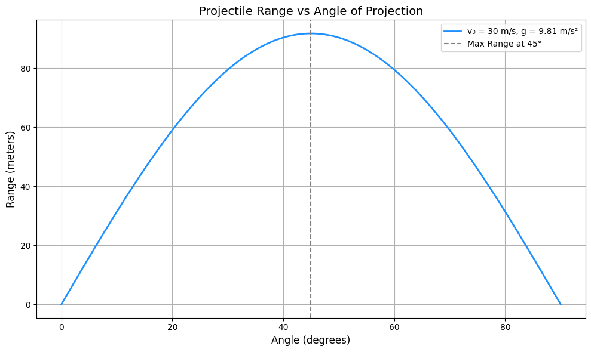
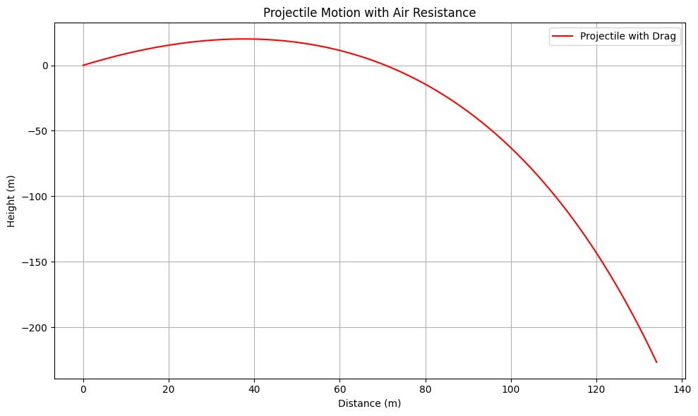

# Problem 1

1. Theoretical Foundation
Derivation of the Equations of Motion
We start with Newton's second law under the assumption of no air resistance:
## 📘 Derivation of the Equations of Motion

We start with **Newton's Second Law** under the assumption of **no air resistance**.

### Horizontal Direction

- Acceleration:  
  
  $$
  a_x = 0
  $$

- Velocity:  
  
   $$ 
   v_x = v_0 \cos(\theta) 
   $$

- Displacement:  
  
  $$
  x(t) = v_0 \cos(\theta) \cdot t
  $$

### 🔹 Vertical Direction

- Acceleration:  
  
  $$
  a_y = -g
  $$

- Velocity:  
  
  $$
  v_y = v_0 \sin(\theta) - g t
  $$

- Displacement:  
 
  $$
  y(t) = v_0 \sin(\theta) \cdot t - \frac{1}{2} g t^2
  $$

---

### ⏱ Time of Flight

The projectile lands when \( y(t) = 0 \). Solve the vertical motion equation:

$$
0 = v_0 \sin(\theta) \cdot t - \frac{1}{2} g t^2
$$

Factor out \( t \):

$$
t \left( v_0 \sin(\theta) - \frac{1}{2} g t \right) = 0
$$

Non-zero solution:

$$
t = \frac{2 v_0 \sin(\theta)}{g}
$$

---

### 📏 Horizontal Range

Use the time of flight in the horizontal displacement:

$$
R = x(t) = v_0 \cos(\theta) \cdot \frac{2 v_0 \sin(\theta)}{g}
$$

Simplify using trigonometric identity 

$$ 
sin(2\theta) = 2 \sin(\theta) \cos(\theta)
$$

$$
R = \frac{v_0^2 \sin(2\theta)}{g}
$$

This equation represents the **ideal range** of a projectile as a function of the launch angle 

$$ 
\theta 
$$

## 📈 2. Analysis of the Range

### 🔹 Maximum Range Condition

The range 

$$ 
R 
$$ 

of a projectile is given by:

$$
R = \frac{v_0^2 \sin(2\theta)}{g}
$$

The **maximum range** occurs when:

$$
\sin(2\theta) = 1 \quad \Rightarrow \quad 2\theta = 90^\circ \quad \Rightarrow \quad \theta = 45^\circ
$$

Thus, the optimal launch angle for maximum horizontal distance (in ideal conditions) is:

$$
\boxed{\theta = 45^\circ}
$$

---

### 🔁 Symmetry of the Range Function

The range function exhibits **symmetry** with respect to 45°:

$$
R(\theta) = R(90^\circ - \theta)
$$

This means that launching a projectile at 

$$
\theta = 30^\circ 
$$

gives the same range as 

$$ 
\theta = 60^\circ 
$$

assuming all other parameters are identical.

---

### ⚙️ Effects of Parameters

#### 🔸 Initial Velocity 

$$ 
v_0 
$$

- The range increases **quadratically** with initial velocity:
 
  $$
  R \propto v_0^2
  $$

#### 🔸 Gravitational Acceleration 

$$
g 
$$


- The range is **inversely proportional** to gravity:
 
  $$
  R \propto \frac{1}{g}
  $$
- Lower gravity (e.g., on the Moon) results in longer ranges.

#### 🔸 Launch Angle 

$$
\theta 
$$

- The dependence on angle is **non-linear** due to the sine function:
  
  $$
  R \propto \sin(2\theta)
  $$

- This leads to a **bell-shaped** range vs. angle graph, peaking at 45°.

---

> ℹ️ These relationships hold under idealized conditions (flat ground, no air resistance). Real-world factors like drag and terrain can alter the outcomes significantly.

## 🌍 3. Practical Applications

Projectile motion isn't just a theoretical exercise—it appears across a wide range of real-world domains. Understanding how launch angle and other factors affect motion is crucial in various disciplines.

---

### 🎯 Sports

- **Application**: Optimizing angles for throwing, kicking, or hitting balls.
- **Examples**: 
  - Determining the best angle for a soccer free kick.
  - Adjusting basketball shot arcs for consistent scoring.
- **Goal**: Maximize distance or precision using ideal angle (close to 45° without air resistance).

---

### 🛠️ Engineering

- **Application**: Design and analysis of projectile or payload launches.
- **Examples**:
  - Military ballistics and artillery targeting.
  - Launch systems for drones or mechanical payloads.
- **Focus**: Controlling trajectory, optimizing for range and accuracy.

---

### 🌌 Astrophysics

- **Application**: Trajectory planning for celestial bodies or spacecraft.
- **Examples**:
  - Launching satellites into orbit.
  - Interplanetary mission path calculations (e.g., Moon landings, Mars probes).
- **Note**: In space, gravity and orbital mechanics replace simple parabolic motion.

---

## ⚠️ Non-Ideal Conditions

Real-world projectile motion is affected by several factors not present in idealized models:

### 🌬️ Air Resistance

- **Effect**: Reduces both range and height.
- **Behavior**: More significant at high speeds or large surface areas.

### 🏔️ Uneven Terrain

- **Effect**: Alters the landing point and effective range.
- **Solution**: Adjust the motion model to account for elevation differences.

### 💨 Wind Effects

- **Effect**: Causes lateral or directional drift.
- **Complexity**: Requires vector addition of wind velocity and projectile motion.

---

> 📌 These considerations must be included for realistic simulations and accurate predictions in applied physics and engineering.

## 💻 4. Implementation (Python)

The following Python script simulates the relationship between **launch angle** and **projectile range** under idealized conditions (no air resistance, flat terrain).

---

### 📌 Python Code: Projectile Range vs. Angle of Projection

```python
import numpy as np
import matplotlib.pyplot as plt

# --- Parameters ---
v0 = 30            # Initial velocity in m/s
g = 9.81           # Gravitational acceleration in m/s²
angles_deg = np.linspace(0, 90, 500)  # Angle values from 0° to 90°
angles_rad = np.radians(angles_deg)  # Convert degrees to radians

# --- Range Calculation ---
# R = (v0² * sin(2θ)) / g
ranges = (v0**2 * np.sin(2 * angles_rad)) / g

# --- Plotting ---
plt.figure(figsize=(10, 6))
plt.plot(angles_deg, ranges, color='dodgerblue', linewidth=2, label=f'v₀ = {v0} m/s, g = {g} m/s²')
plt.axvline(x=45, color='gray', linestyle='--', label='Max Range at 45°')

# --- Labels and Title ---
plt.title('Projectile Range vs Angle of Projection', fontsize=14)
plt.xlabel('Angle (degrees)', fontsize=12)
plt.ylabel('Range (meters)', fontsize=12)
plt.grid(True)
plt.legend()
plt.tight_layout()
plt.show()
```



## 📈 Graphical Insights

Understanding the graph of **Projectile Range vs. Launch Angle** reveals important physical behaviors of motion.

---

### 🔁 Symmetry About 45°

- The curve is **symmetric** about:

  $$
  \theta = 45^\circ
  $$

- This means:
  
  $$
  R(\theta) = R(90^\circ - \theta)
  $$

- Launching at 30° or 60° produces the same range, assuming identical conditions.

---

### 🚀 Effect of Initial Velocity \( v_0 \)

- As **initial velocity increases**, the range curve **scales upward** (quadratic relation).
  
  $$
  R \propto v_0^2
  $$

- The **optimal launch angle** remains:

  $$
  \theta = 45^\circ
  $$

---

### 🌬️ Real-World Effects: Air Resistance

- In real-life scenarios:
  - The curve **flattens** (range decreases).
  - The peak **shifts left**, meaning the optimal angle is often **< 45°**.
  
- Why?
  - Air drag reduces both **speed** and **range**.
  - The projectile loses energy faster at higher arcs.

---

> ✅ These graphical patterns are essential when applying projectile theory to sports, aerospace, and simulation environments.

## ⚠️ Limitations & Extensions

While the ideal projectile motion model is elegant and insightful, it makes several assumptions that limit its real-world applicability.

---

### ❌ Limitations of the Ideal Model

- **No Air Resistance**  
  Ignores aerodynamic drag, which significantly affects motion in real-life scenarios.

- **No Wind or Spin**  
  Omits external influences like wind gusts or ball/projectile spin.

- **Flat Terrain Assumption**  
  Assumes the projectile is launched and lands at the same height on flat ground.

- **Constant Gravitational Field**  
  Assumes gravity remains uniform, which may not hold true over large distances or altitudes.

---

### 🔧 How to Extend the Model

- **Include Air Resistance**  
  Use numerical methods like **Euler** or **Runge-Kutta** to integrate drag force:

  $$
  F_{\text{drag}} = -kv^2
  $$

- **Model Uneven Terrain**  
  Define a dynamic **ground height function** 
  
  
$$
h(x)
$$

to represent variable landing surfaces.

- **Add Wind Effects**  
  Incorporate **wind velocity** as an additional horizontal vector component:

  $$
  v_{\text{effective}} = v_{0,x} + v_{\text{wind}}
  $$

---

> 🧠 These extensions bring the model closer to real-world physics and are especially useful in simulations for sports, aerospace, and robotics.

## 🔢 Numerical Simulations for Non-Ideal Cases

To simulate projectile motion under **drag** or other real-world factors, numerical methods are essential. Below is a guide on how to simulate projectile motion incorporating drag force using Python.

---

### 📌 Sample Pseudocode for Projectile Motion with Drag

We can model the motion of a projectile subject to air resistance using the following equations:

- **Horizontal Motion (x)**:  
  
  $$
  \frac{d v_x}{dt} = -k v_x
  $$
  
- **Vertical Motion (y)**:  
  
  $$
  \frac{d v_y}{dt} = -g - k v_y
  $$

- **Position Update**:  
  
  $$
  \frac{dx}{dt} = v_x, \quad \frac{dy}{dt} = v_y
  $$

Where:
 
$$ 
v_x 
$$ 

and 

$$ 
v_y 
$$ 

are the velocity components in the horizontal and vertical directions.

$$ 
g 
$$ 

is gravitational acceleration.

$$ 
k 
$$ 

is the drag coefficient (depends on air density, shape, and size of the projectile).

### 🔧 Using Numerical Solvers

We can use libraries like **SciPy**'s `odeint` or `solve_ivp` to solve these differential equations. Here's a rough outline of how to implement it:

```python
import numpy as np
from scipy.integrate import solve_ivp
import matplotlib.pyplot as plt

# Parameters
v0 = 30  # Initial velocity in m/s
angle = 45  # Launch angle in degrees
g = 9.81  # Gravitational acceleration in m/s²
k = 0.1  # Drag coefficient (adjust as needed)
angle_rad = np.radians(angle)  # Convert angle to radians

# Initial conditions
vx0 = v0 * np.cos(angle_rad)  # Initial horizontal velocity
vy0 = v0 * np.sin(angle_rad)  # Initial vertical velocity
initial_conditions = [0, 0, vx0, vy0]  # [x0, y0, vx0, vy0]

# Define the system of differential equations
def projectile_with_drag(t, y):
    x, y_pos, vx, vy = y
    dxdt = vx
    dydt = vy
    dvxdt = -k * vx
    dvydt = -g - k * vy
    return [dxdt, dydt, dvxdt, dvydt]

# Time span and evaluation points
t_span = (0, 10)  # Simulate for 10 seconds
t_eval = np.linspace(0, 10, 500)

# Solve the system of equations
solution = solve_ivp(projectile_with_drag, t_span, initial_conditions, t_eval=t_eval)

# Extract results
x, y_pos = solution.y[0], solution.y[1]

# Plot the trajectory
plt.figure(figsize=(10, 6))
plt.plot(x, y_pos, label="Projectile with Drag", color='red')
plt.title('Projectile Motion with Air Resistance')
plt.xlabel('Distance (m)')
plt.ylabel('Height (m)')
plt.grid(True)
plt.legend()
plt.tight_layout()
plt.show()
```


[visit website](https://colab.research.google.com/drive/12e4SEoh-Xdq62-cyfThP4y7GKXT5J23y#scrollTo=kOK303wNHwKm&uniqifier=4)


