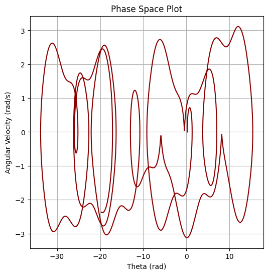
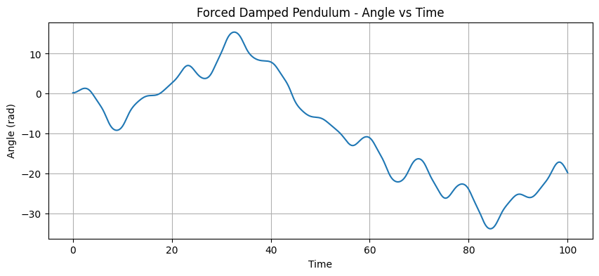
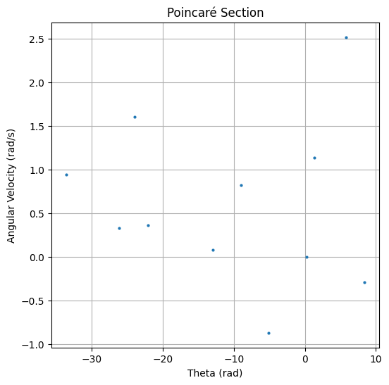

# Investigating the Dynamics of a Forced Damped Pendulum

## Motivation

The forced damped pendulum is a captivating example of a physical system with intricate behavior resulting from the interplay of damping, restoring forces, and external driving forces. By introducing both damping and external periodic forcing, the system demonstrates a transition from simple harmonic motion to a rich spectrum of dynamics, including resonance, chaos, and quasiperiodic behavior. These phenomena serve as a foundation for understanding complex real-world systems, such as driven oscillators, climate systems, and mechanical structures under periodic stress.

Adding forcing introduces new parameters, such as the amplitude and frequency of the external force, which significantly affect the pendulum's behavior. By systematically varying these parameters, a diverse class of solutions can be observed, including synchronized oscillations, chaotic motion, and resonance phenomena. These behaviors not only highlight fundamental physics principles but also provide insights into engineering applications such as energy harvesting, vibration isolation, and mechanical resonance.

---

## Task Outline

### 1. Theoretical Foundation

Start with the differential equation governing the motion of a forced damped pendulum:

$$
 \frac{d^2\theta}{dt^2} + \gamma \frac{d\theta}{dt} + \omega_0^2 \sin(\theta) = A \cos(\omega t) 
$$

For small-angle oscillations (\( \theta \ll 1 \)), this simplifies to:

$$ 
\frac{d^2\theta}{dt^2} + \gamma \frac{d\theta}{dt} + \omega_0^2 \theta = A \cos(\omega t) 
$$

From this linearized equation, approximate solutions can be derived. Resonance occurs when the driving frequency \( \omega \) approaches the natural frequency \( \omega_0 \), leading to maximal energy transfer to the system.

---

### 2. Analysis of Dynamics

- **Damping Coefficient 

$$ 
\gamma 
$$

**: Determines the rate at which energy is lost.
- **Driving Amplitude 

$$ 
A 
$$

**: Influences the energy supplied to the system.
- **Driving Frequency 

$$ 
\omega 
$$

**: Key parameter affecting resonance and chaotic behavior.

The transition from regular to chaotic motion can be visualized using phase portraits, Poincaré sections, and bifurcation diagrams.

---

### 3. Practical Applications

- **Energy Harvesting Devices**: Oscillators tuned to ambient vibrations.
- **Suspension Bridges**: Vibrations due to wind or traffic modeled as driven pendulums.
- **Oscillating Circuits**: RLC circuits obey similar differential equations.

---

### 4. Implementation


```python
import numpy as np
import matplotlib.pyplot as plt
from scipy.integrate import solve_ivp

# Parameters
gamma = 0.2        # Damping coefficient
omega0 = 1.0       # Natural frequency
A = 1.2            # Driving amplitude
omega_d = 0.666    # Driving frequency

# Time span
t_span = (0, 100)
t_eval = np.linspace(*t_span, 10000)

# Differential equation
def forced_damped_pendulum(t, y):
    theta, omega = y
    dtheta_dt = omega
    domega_dt = -gamma * omega - omega0**2 * np.sin(theta) + A * np.cos(omega_d * t)
    return [dtheta_dt, domega_dt]

# Initial conditions
y0 = [0.2, 0]

# Solve ODE
sol = solve_ivp(forced_damped_pendulum, t_span, y0, t_eval=t_eval, method='RK45')

# Plotting
plt.figure(figsize=(10, 4))
plt.plot(sol.t, sol.y[0])
plt.xlabel('Time')
plt.ylabel('Angle (rad)')
plt.title('Forced Damped Pendulum - Angle vs Time')
plt.grid(True)
plt.show()

# Phase Diagram
plt.figure(figsize=(6, 6))
plt.plot(sol.y[0], sol.y[1], color='darkred')
plt.xlabel('Theta (rad)')
plt.ylabel('Angular Velocity (rad/s)')
plt.title('Phase Space Plot')
plt.grid(True)
plt.show()

# Poincaré Section
poincare_times = np.arange(0, t_span[1], 2*np.pi/omega_d)
poincare_indices = [np.argmin(np.abs(sol.t - t)) for t in poincare_times]
theta_poincare = sol.y[0][poincare_indices]
omega_poincare = sol.y[1][poincare_indices]

plt.figure(figsize=(6, 6))
plt.plot(theta_poincare, omega_poincare, 'o', markersize=2)
plt.xlabel('Theta (rad)')
plt.ylabel('Angular Velocity (rad/s)')
plt.title('Poincaré Section')
plt.grid(True)
plt.show()
```




---

## Deliverables

- Markdown document or Jupyter Notebook with Python code
- Detailed explanation of theoretical derivations and numerical modeling
- Plots:
  - Angle vs Time
  - Phase portraits
  - Poincaré sections
- (Optional) Bifurcation diagrams for sweeping \( A \) or \( \omega \)
- Discussion of model limitations and potential extensions

---

## Hints and Resources

- Use small-angle approximation where applicable.
- Use numerical methods (e.g., Runge-Kutta) for general case.
- Map analogy to driven RLC circuits and biological oscillations.
- Tools: Python, NumPy, Matplotlib, SciPy.

This task bridges theoretical analysis with computational exploration, fostering a deeper understanding of forced and damped oscillatory phenomena and their implications in both physics and engineering.
