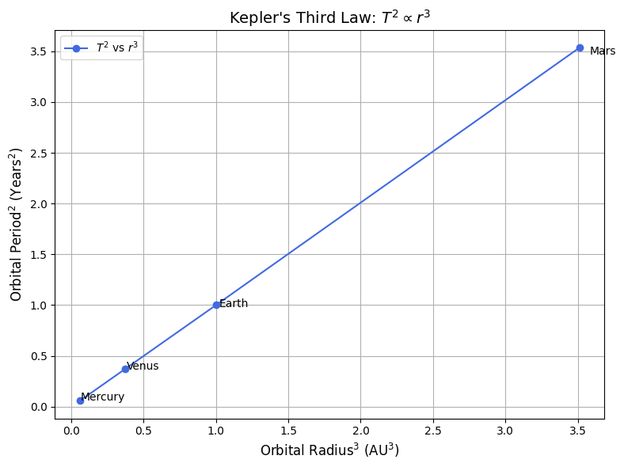
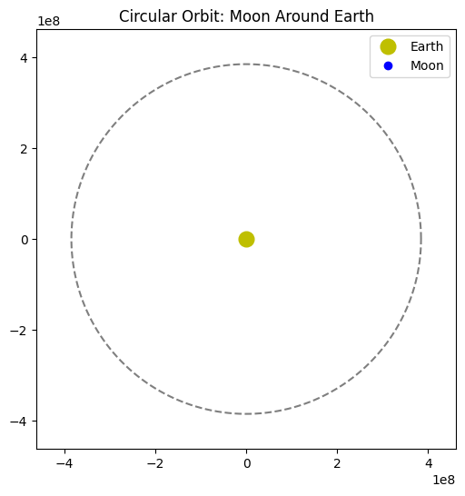
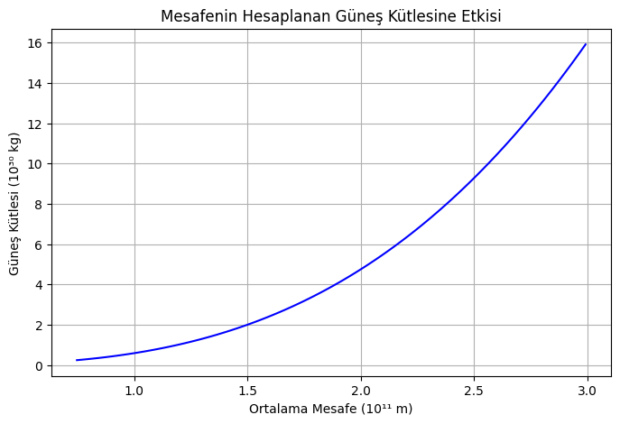
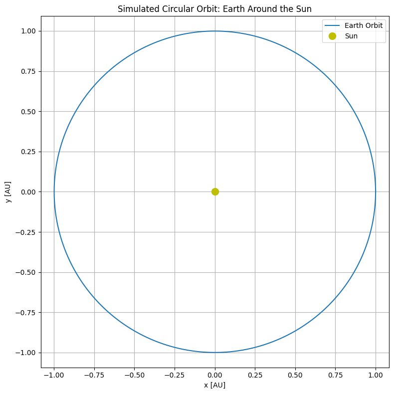

# Orbital Period and Orbital Radius

## Motivation
The relationship between the square of the orbital period and the cube of the orbital radius, known as **Kepler's Third Law**, is a cornerstone of celestial mechanics. This simple yet profound law allows for the determination of planetary motions and has broad implications for understanding gravitational interactions in systems ranging from satellites to galaxies. By analyzing this relationship, we can connect fundamental principles of Newtonian gravity to observable phenomena such as the orbits of planets and moons.

---

## 1. Derivation of Kepler's Third Law for Circular Orbits

### Newton's Law of Universal Gravitation:
$$
F = \frac{G M m}{r^2}
$$

### Centripetal Force for Circular Orbit:
$$
F = \frac{m v^2}{r}
$$

Equating the two forces:
$$
\frac{G M m}{r^2} = \frac{m v^2}{r}
\Rightarrow v^2 = \frac{G M}{r}
$$

The orbital period \(T\) is the time to complete one full circle:
$$
T = \frac{2\pi r}{v}
\Rightarrow T^2 = \frac{4\pi^2 r^2}{v^2}
$$

Substituting for \(v^2\):
$$
T^2 = \frac{4\pi^2 r^3}{G M}
$$

### Final Form of Kepler's Third Law:
$$
T^2 \propto r^3
$$

---

## 2. Astronomical Implications

- This law allows astronomers to **calculate the mass of a central body** (e.g., the Sun, a planet) by observing the orbital radius and period of a satellite or planet.
- It provides a **method to determine distances** in astronomical units without direct measurement.
- Enables comparison between different planetary systems.

---

## 3. Real-World Examples

### Example: The Moon's Orbit
- Average radius \( r = 3.84 \times 10^8 \) m  
- Period 

$$ 
T = 27.3 
$$

 days 
 
 $$ 
 \approx 2.36 \times 10^6 
 $$
 
  seconds

$$
\frac{T^2}{r^3} \approx \text{Constant}
$$

### Example: Earth's Orbit Around the Sun
 
$$ 
r = 1 \, \text{AU} = 1.496 \times 10^{11} 
$$

 m  
 
 $$
  T = 1 \, \text{year} = 3.154 \times 10^7
 $$ 
 
 s

These examples confirm the 

$$ 
T^2 \propto r^3
 $$

 relationship.

 ### 1. Moon's Orbit Around Earth
```python
import numpy as np
import matplotlib.pyplot as plt

# Constants
G = 6.67430e-11  # m^3 kg^-1 s^-2
M_earth = 5.972e24  # kg
r_moon = 384400e3  # m

# Calculate orbital period
T_moon = 2 * np.pi * np.sqrt(r_moon**3 / (G * M_earth))
T_moon_days = T_moon / (60 * 60 * 24)
print(f"Orbital Period of Moon: {T_moon_days:.2f} days")
```

Orbital Period of Moon: 27.45 days

## Extension to Elliptical Orbits
Kepler's Third Law also applies to elliptical orbits when using the semi-major axis `a` instead of radius `r`:

$$
 T^2 = \frac{4\pi^2}{GM} a^3 
 $$

This version holds true for all elliptical orbits, making the law universally applicable to binary stars, moons, and exoplanets.

---
**Conclusion:**
Kepler's Third Law connects orbital periods and radii through gravity's universal law. Whether examining artificial satellites or exoplanets, this principle guides modern astronomy and space science.

```python
import numpy as np
import matplotlib.pyplot as plt

# Orbital radius in AU and orbital period in years for selected planets
radii_au = np.array([0.39, 0.72, 1.0, 1.52])  # Mercury to Mars
periods_years = np.array([0.24, 0.61, 1.0, 1.88])
planet_names = ['Mercury', 'Venus', 'Earth', 'Mars']

# Calculate r^3 and T^2
r_cubed = radii_au**3
T_squared = periods_years**2

# Plotting
plt.figure(figsize=(8, 6))
plt.plot(r_cubed, T_squared, 'o-', color='royalblue', label=r"$T^2$ vs $r^3$")

# Annotate each point with the planet name
for i, name in enumerate(planet_names):
    plt.text(r_cubed[i] * 1.02, T_squared[i] * 0.98, name, fontsize=10)

plt.xlabel(r"Orbital Radius$^3$ (AU$^3$)", fontsize=12)
plt.ylabel(r"Orbital Period$^2$ (Years$^2$)", fontsize=12)
plt.title("Kepler's Third Law: $T^2 \propto r^3$", fontsize=14)
plt.grid(True)
plt.legend()
plt.tight_layout()
plt.show()
```


```python
import numpy as np
import matplotlib.pyplot as plt
from matplotlib.animation import FuncAnimation

# Constants
r = 384400e3  # Radius of Moon's orbit in meters
T = 27.3 * 24 * 3600  # Period in seconds

# Time values
n_frames = 200
time_vals = np.linspace(0, T, n_frames)

# Orbital position calculations
x_vals = r * np.cos(2 * np.pi * time_vals / T)
y_vals = r * np.sin(2 * np.pi * time_vals / T)

# Set up the plot
fig, ax = plt.subplots(figsize=(6, 6))
ax.set_xlim(-1.2*r, 1.2*r)
ax.set_ylim(-1.2*r, 1.2*r)
ax.set_aspect('equal')
ax.plot(0, 0, 'yo', markersize=12, label='Earth')
orbit_path, = ax.plot([], [], 'k--', alpha=0.5)
moon, = ax.plot([], [], 'bo', label='Moon')

def init():
    orbit_path.set_data(x_vals, y_vals)
    moon.set_data([], [])
    return orbit_path, moon

def update(frame):
    moon.set_data(x_vals[frame], y_vals[frame])
    return moon,

ani = FuncAnimation(fig, update, frames=n_frames, init_func=init, blit=True)
plt.title("Circular Orbit: Moon Around Earth")
plt.legend()
plt.show()
```




```python
import numpy as np

# Evrensel çekim sabiti (m^3 kg^-1 s^-2)
G = 6.67430e-11  

# Dünya'nın Güneş etrafındaki ortalama yörünge yarıçapı (m)
r = 1.496e11  

# Dünya'nın Güneş etrafındaki tam tur süresi (saniye cinsinden)
T = 365.25 * 24 * 60 * 60  # 1 yıl = 365.25 gün

# Güneş kütlesini hesapla
M = (4 * np.pi**2 * r**3) / (G * T**2)

print(f"Güneş'in hesaplanan kütlesi: {M:.2e} kg")
```

# 🌍 Kepler Yasaları ile Güneş Kütlesi Hesaplama

## ⚡ Kullanılan Formüller

Kepler'in Üçüncü Yasası ve Newton'un Evrensel Çekim Yasası birleştirilirse:

$$
T^2 = \frac{4\pi^2 r^3}{G M}
$$

Buradan Güneş'in kütlesi \( M \) şöyle bulunur:

$$
M = \frac{4\pi^2 r^3}{G T^2}
$$

---

## 📋 Parametreler

- \( G = 6.67430 \times 10^{-11} \, \text{m}^3\, \text{kg}^{-1}\, \text{s}^{-2} \) (Evrensel çekim sabiti)
- \( r = 1.496 \times 10^{11} \, \text{m} \) (Dünya-Güneş ortalama mesafesi)
- \( T = 365.25 \times 24 \times 60 \times 60 \, \text{saniye} \) (Bir yıl)

---

## 🔢 Hesaplama Adımları

- \( r^3 \) hesaplanır.
- \( T^2 \) hesaplanır.
- Sonra formül yerine konularak \( M \) hesaplanır.

---

## 🧮 Python Kodu

```python
import numpy as np

# Evrensel çekim sabiti
G = 6.67430e-11  

# Dünya-Güneş arası mesafe
r = 1.496e11  

# Yörünge süresi
T = 365.25 * 24 * 60 * 60  

# Güneş kütlesini bul
M = (4 * np.pi**2 * r**3) / (G * T**2)

print(f"Güneş'in hesaplanan kütlesi: {M:.2e} kg")
```


```python
import numpy as np
import matplotlib.pyplot as plt

# Constants
G = 6.67430e-11         # Gravitational constant, m^3 kg^-1 s^-2
M_sun = 1.989e30        # Mass of the Sun, kg
AU = 1.496e11           # Astronomical unit in meters
v_earth = 29_780        # Orbital speed of Earth in m/s (approximate)

# Simulation parameters
dt = 60 * 60            # Time step: 1 hour
T = 365.25 * 24 * 3600  # 1 year in seconds
steps = int(T / dt)

# Initialize arrays
pos = np.zeros((steps, 2))
vel = np.zeros((steps, 2))

# Initial position: 1 AU from Sun
pos[0] = [AU, 0]

# Initial velocity: perpendicular to position vector (for circular orbit)
vel[0] = [0, v_earth]

# Euler integration to update position and velocity
for i in range(1, steps):
    r = np.linalg.norm(pos[i-1])
    acc = -G * M_sun * pos[i-1] / r**3
    vel[i] = vel[i-1] + acc * dt
    pos[i] = pos[i-1] + vel[i] * dt

# Plotting
plt.figure(figsize=(8, 8))
plt.plot(pos[:, 0] / AU, pos[:, 1] / AU, label='Earth Orbit')
plt.plot(0, 0, 'yo', markersize=10, label='Sun')  # Sun at origin
plt.xlabel("x [AU]")
plt.ylabel("y [AU]")
plt.title("Simulated Circular Orbit: Earth Around the Sun")
plt.axis('equal')
plt.grid(True)
plt.legend()
plt.tight_layout()
plt.show()

```


```python
# Linear regression (for illustrative best-fit)

from scipy.stats import linregress

slope, intercept, r_value, _, _ = linregress(r_cubed, T_squared)
fit_line = slope * r_cubed + intercept

plt.figure(figsize=(8, 6))
plt.plot(r_cubed, T_squared, 'o', label="Observed")
plt.plot(r_cubed, fit_line, '-', label=f"Best Fit: $T^2 = {slope:.2f}r^3 + {intercept:.2f}$")
plt.xlabel(r"Orbital Radius$^3$ (AU$^3$)")
plt.ylabel(r"Orbital Period$^2$ (Years$^2$)")
plt.title("Kepler's Third Law Linear Fit")
plt.legend()
plt.grid(True)
plt.tight_layout()
plt.show()
```
## My Colab

[visit website](https://colab.research.google.com/drive/1AeApmcVpYZswniM9LacdcCTsymshHwa4?usp=sharing)

---


