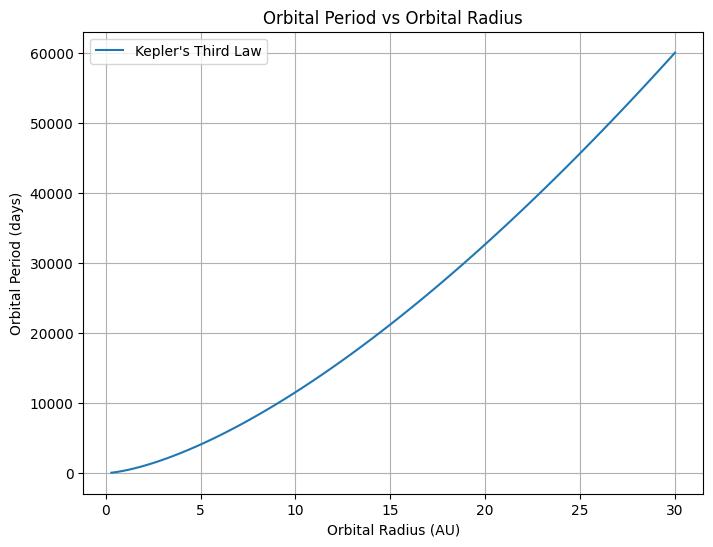

# Orbital Period and Orbital Radius

## Motivation
The relationship between the square of the orbital period and the cube of the orbital radius, known as **Kepler's Third Law**, is a cornerstone of celestial mechanics. This simple yet profound law allows for the determination of planetary motions and has broad implications for understanding gravitational interactions in systems ranging from satellites to galaxies. By analyzing this relationship, we can connect fundamental principles of Newtonian gravity to observable phenomena such as the orbits of planets and moons.

---

## 1. Derivation of Kepler's Third Law for Circular Orbits

### Newton's Law of Universal Gravitation:
$$
F = \frac{G M m}{r^2}
$$

### Centripetal Force for Circular Orbit:
$$
F = \frac{m v^2}{r}
$$

Equating the two forces:
$$
\frac{G M m}{r^2} = \frac{m v^2}{r}
\Rightarrow v^2 = \frac{G M}{r}
$$

The orbital period \(T\) is the time to complete one full circle:
$$
T = \frac{2\pi r}{v}
\Rightarrow T^2 = \frac{4\pi^2 r^2}{v^2}
$$

Substituting for \(v^2\):
$$
T^2 = \frac{4\pi^2 r^3}{G M}
$$

### Final Form of Kepler's Third Law:
$$
T^2 \propto r^3
$$

---

## 2. Astronomical Implications

- This law allows astronomers to **calculate the mass of a central body** (e.g., the Sun, a planet) by observing the orbital radius and period of a satellite or planet.
- It provides a **method to determine distances** in astronomical units without direct measurement.
- Enables comparison between different planetary systems.

---

## 3. Real-World Examples

### Example: The Moon's Orbit
- Average radius \( r = 3.84 \times 10^8 \) m  
- Period 

$$ 
T = 27.3 
$$

 days 
 
 $$ 
 \approx 2.36 \times 10^6 
 $$
 
  seconds

$$
\frac{T^2}{r^3} \approx \text{Constant}
$$

### Example: Earth's Orbit Around the Sun
 
$$ 
r = 1 \, \text{AU} = 1.496 \times 10^{11} 
$$

 m  
 
 $$
  T = 1 \, \text{year} = 3.154 \times 10^7
 $$ 
 
 s

These examples confirm the 

$$ 
T^2 \propto r^3
 $$

 relationship.

---

## 4. Python Simulation of Circular Orbits

```python
import numpy as np
import matplotlib.pyplot as plt

# Constants
G = 6.67430e-11  # gravitational constant
M = 1.989e30     # mass of the Sun

# Orbital radius values (m)
radii = np.linspace(0.3, 30, 100) * 1.496e11  # from 0.3 AU to 30 AU

# Calculate periods (s) using Kepler's Law
T = 2 * np.pi * np.sqrt(radii**3 / (G * M))

# Plotting
plt.figure(figsize=(8, 6))
plt.plot(radii / 1.496e11, T / (60*60*24), label="Kepler's Third Law")
plt.xlabel('Orbital Radius (AU)')
plt.ylabel('Orbital Period (days)')
plt.title("Orbital Period vs Orbital Radius")
plt.grid(True)
plt.legend()
plt.show()
```

