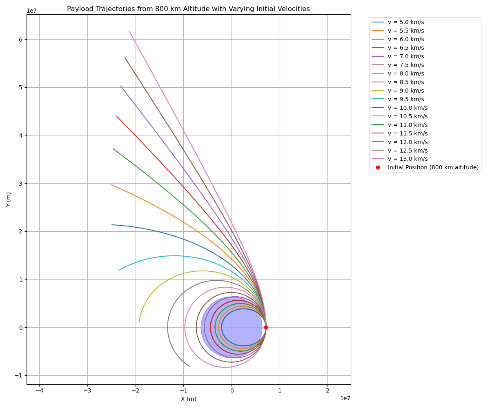

# Trajectories of a Freely Released Payload Near Earth

## Introduction
When a payload is released from a moving rocket near Earth, its trajectory is governed by gravitational forces and initial conditions (position and velocity). This problem involves orbital mechanics, numerical methods, and visualization to analyze possible paths: elliptical, parabolic, or hyperbolic. Understanding these trajectories is critical for space mission planning, such as orbital insertion, atmospheric reentry, or escape from Earth's gravity.

This document provides:
1. A theoretical overview of gravitational dynamics and trajectory types.
2. A numerical simulation using Python to compute and visualize payload trajectories.
3. Discussion of real-world applications.

## Theoretical Background

### Newton's Law of Gravitation
The gravitational force between Earth (mass $M$) and a payload (mass $m$) is given by:
$$
F = \frac{G M m}{r^2}
$$
where:
- $G = 6.674 \times 10^{-11} \, \text{m}^3 \text{kg}^{-1} \text{s}^{-2}$ is the gravitational constant,
- $r$ is the distance from Earth's center,
- $M = 5.972 \times 10^{24} \, \text{kg}$ is Earth's mass.

The acceleration of the payload is:
$$
\ddot{\mathbf{r}} = -\frac{G M}{r^3} \mathbf{r}
$$
where $\mathbf{r}$ is the position vector, and $r = |\mathbf{r}|$.

### Types of Trajectories
The trajectory depends on the specific energy of the payload, determined by its velocity $v$ and distance $r$:
$$
\epsilon = \frac{v^2}{2} - \frac{G M}{r}
$$
- **Elliptical orbit** ($\epsilon < 0$): The payload remains bound to Earth, following a closed orbit (e.g., satellite deployment).
- **Parabolic trajectory** ($\epsilon = 0$): The payload achieves escape velocity, just sufficient to leave Earth's gravity (e.g., marginal escape).
- **Hyperbolic trajectory** ($\epsilon > 0$): The payload has excess energy, escaping Earth's gravity with residual velocity (e.g., interplanetary missions).

### Vis-Viva Equation
The relationship between velocity, distance, and semi-major axis $a$ is:
$$
v^2 = G M \left( \frac{2}{r} - \frac{1}{a} \right)
$$
- For elliptical orbits, $a > 0$.
- For parabolic trajectories, $a \to \infty$.
- For hyperbolic trajectories, $a < 0$.

### Escape Velocity
The minimum velocity to escape Earth's gravity at distance $r$ is:
$$
v_{\text{esc}} = \sqrt{\frac{2 G M}{r}}
$$

## Numerical Simulation

We simulate the payload's motion using Python, solving the differential equation $\ddot{\mathbf{r}} = -\frac{G M}{r^3} \mathbf{r}$ with initial conditions. The `scipy.integrate` library is used for numerical integration, and `matplotlib` for visualization.

### Assumptions
- Earth is a point mass at its center.
- No atmospheric drag or other forces (e.g., solar radiation).
- 2D motion in the orbital plane for simplicity.
- Initial conditions:
  - Altitude: 400 km (Low Earth Orbit, LEO).
  - Initial position: $r_0 = R_E + 400 \, \text{km}$, where $R_E = 6,371 \, \text{km}$ (Earth's radius).
  - Initial velocity: Varies to produce elliptical, parabolic, or hyperbolic trajectories.

### Python Code
The following script simulates and visualizes the payload's trajectory for three cases.

```python
import numpy as np
import matplotlib.pyplot as plt
from scipy.integrate import odeint

# Constants
G = 6.674e-11  # Gravitational constant (m^3 kg^-1 s^-2)
M = 5.972e24   # Earth's mass (kg)
R_E = 6.371e6  # Earth's radius (m)
mu = G * M     # Gravitational parameter (m^3 s^-2)

# Initial conditions
h = 800e3      # Altitude (m)
r0 = R_E + h   # Initial distance from Earth's center (m)
x0 = r0        # Initial x-position (m)
y0 = 0         # Initial y-position (m)

# Initial velocities (km/s to m/s)
velocities = np.arange(5, 13.5, 0.5) * 1e3  # [5, 5.5, ..., 13] km/s

# Equations of motion
def motion(state, t):
    x, y, vx, vy = state
    r = np.sqrt(x**2 + y**2)
    ax = -mu * x / r**3
    ay = -mu * y / r**3
    return [vx, vy, ax, ay]

# Time array (2 hours for sufficient trajectory visibility)
t = np.linspace(0, 7200, 1000)

# Simulate trajectories
trajectories = []
for v in velocities:
    state0 = [x0, y0, 0, v]  # Initial state: [x, y, vx, vy]
    states = odeint(motion, state0, t)
    trajectories.append(states)

# Plotting
plt.figure(figsize=(12, 10))

# Plot Earth
earth = plt.Circle((0, 0), R_E, color='blue', alpha=0.3)
plt.gca().add_patch(earth)

# Plot trajectories
for i, traj in enumerate(trajectories):
    plt.plot(traj[:, 0], traj[:, 1], label=f'v = {velocities[i]/1e3:.1f} km/s')

# Mark initial position
plt.plot(x0, y0, 'ro', label='Initial Position (800 km altitude)')

plt.xlabel('X (m)')
plt.ylabel('Y (m)')
plt.title('Payload Trajectories from 800 km Altitude with Varying Initial Velocities')
plt.legend(bbox_to_anchor=(1.05, 1), loc='upper left')
plt.grid(True)
plt.axis('equal')
plt.tight_layout()
plt.savefig('trajectories_varied_velocities.png')
plt.close()
```


### Explanation of Code
- **Constants**: Define gravitational parameters and Earth's properties.
- **Initial Conditions**: Payload released at 400 km altitude with zero initial x-velocity and varying y-velocities.
- **Numerical Integration**: Use `odeint` to solve the differential equations of motion.
- **Visualization**: Plot Earth as a circle and overlay the trajectories.

## Results
The simulation produces three trajectories:
1. **Elliptical**: The payload orbits Earth in a closed path, suitable for satellite deployment.
2. **Parabolic**: The payload escapes Earth's gravity with zero residual velocity at infinity.
3. **Hyperbolic**: The payload escapes with excess velocity, typical for interplanetary missions.

The plot (`trajectories.png`) shows:
- Earth as a blue circle.
- Green curve: Elliptical orbit, looping around Earth.
- Orange curve: Parabolic trajectory, diverging from Earth.
- Red curve: Hyperbolic trajectory, diverging more sharply.

## Applications
- **Orbital Insertion**: Elliptical trajectories are used for satellites or space stations in LEO. The payload must achieve sufficient velocity (e.g., ~7.67 km/s at 400 km) to maintain orbit.
- **Reentry**: If the payload's velocity is reduced (e.g., via thrusters), it may enter a sub-elliptical trajectory, leading to atmospheric reentry.
- **Escape Missions**: Hyperbolic trajectories are critical for missions to the Moon, Mars, or beyond, requiring velocities exceeding escape velocity (~10.84 km/s at 400 km).

## Limitations
- The model assumes a two-body problem, ignoring atmospheric drag, Earth's oblateness, or other celestial bodies.
- 2D simplification limits applicability to non-planar orbits.
- Higher altitudes or complex maneuvers require additional considerations (e.g., Hohmann transfers).

## Conclusion
The trajectories of a freely released payload near Earth depend on its initial velocity relative to the escape velocity. Numerical simulations provide insights into orbital mechanics, enabling precise mission planning. The provided Python tool visualizes these trajectories, serving as a foundation for further exploration in space mission design.

## My Colab

[visit website](https://colab.research.google.com/drive/1AeApmcVpYZswniM9LacdcCTsymshHwa4?usp=sharing)

---
