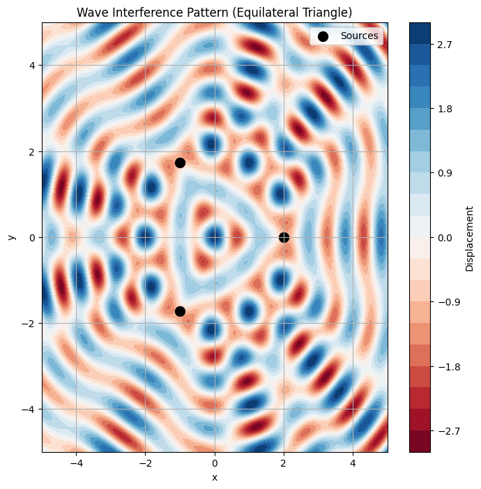

# Wave Interference Analysis on Water Surface

This document analyzes the interference patterns formed by circular waves emitted from point sources positioned at the vertices of a regular polygon on a water surface. We will use an equilateral triangle as the polygon, implement the simulation in Python, and visualize the resulting patterns.

## Step 1: Select a Regular Polygon
We choose an **equilateral triangle** with vertices at positions determined by its geometry. The side length of the triangle is set to \( a = 2 \) units for simplicity.

## Step 2: Position the Sources
For an equilateral triangle centered at the origin \((0, 0)\), the vertices are positioned at:
- Vertex 1: \((a \cos(0^\circ), a \sin(0^\circ)) = (a, 0)\)
- Vertex 2: \((a \cos(120^\circ), a \sin(120^\circ)) = \left(-\frac{a}{2}, \frac{a\sqrt{3}}{2}\right)\)
- Vertex 3: \((a \cos(240^\circ), a \sin(240^\circ)) = \left(-\frac{a}{2}, -\frac{a\sqrt{3}}{2}\right)\)

Substituting \( a = 2 \):
- Vertex 1: \((2, 0)\)
- Vertex 2: \((-1, \sqrt{3})\)
- Vertex 3: \((-1, -\sqrt{3})\)

## Step 3: Wave Equations
The displacement due to a single point source at position \((x_i, y_i)\) is given by:
$$
\eta_i(x, y, t) = A \cos(k r_i - \omega t + \phi)
$$
where:
- \( A \): Amplitude (set to 1 for simplicity),
- \( k = \frac{2\pi}{\lambda} \): Wave number, with wavelength \(\lambda = 1\),
- \( \omega = 2\pi f \): Angular frequency, with frequency \( f = 1 \),
- \( r_i = \sqrt{(x - x_i)^2 + (y - y_i)^2} \): Distance from source \((x_i, y_i)\) to point \((x, y)\),
- \( \phi \): Initial phase (set to 0 for coherence).

Thus:
$$
k = \frac{2\pi}{1} = 2\pi, \quad \omega = 2\pi \cdot 1 = 2\pi
$$
The wave equation for source \( i \):
$$
\eta_i(x, y, t) = \cos(2\pi r_i - 2\pi t)
$$

## Step 4: Superposition of Waves
The total displacement at point \((x, y)\) and time \( t \) is the sum of displacements from all \( N = 3 \) sources:
$$
\eta(x, y, t) = \sum_{i=1}^3 \eta_i(x, y, t) = \sum_{i=1}^3 \cos(2\pi r_i - 2\pi t)
$$

## Step 5: Analyze Interference Patterns
- **Constructive Interference**: Occurs when waves are in phase, i.e., \( 2\pi r_i - 2\pi t \) differs by multiples of \( 2\pi \) across sources, leading to large \( |\eta| \).
- **Destructive Interference**: Occurs when waves are out of phase, e.g., phase differences of \( \pi \), causing \( \eta \approx 0 \).

The interference pattern depends on the spatial distribution of \( r_i \), which varies with the geometry of the triangle.

## Step 6: Visualization
We use Python with Matplotlib to simulate and visualize the interference pattern on a 2D grid at a fixed time \( t = 0 \).

### Python Code
Below is the Python script to compute and visualize the interference pattern.

```python
import numpy as np
import matplotlib.pyplot as plt

# Parameters
A = 1.0        # Amplitude
lambda_ = 1.0  # Wavelength
k = 2 * np.pi / lambda_  # Wave number
omega = 2 * np.pi      # Angular frequency (f = 1)
t = 0.0        # Time
a = 2.0        # Side length of equilateral triangle

# Source positions (vertices of equilateral triangle)
sources = [
    (a, 0),
    (-a/2, a*np.sqrt(3)/2),
    (-a/2, -a*np.sqrt(3)/2)
]

# Create grid
x = np.linspace(-5, 5, 200)
y = np.linspace(-5, 5, 200)
X, Y = np.meshgrid(x, y)
Z = np.zeros_like(X)

# Compute total displacement
for (x_i, y_i) in sources:
    r_i = np.sqrt((X - x_i)**2 + (Y - y_i)**2)
    Z += A * np.cos(k * r_i - omega * t)

# Plotting

plt.figure(figsize=(8, 8))
plt.contourf(X, Y, Z, levels=20, cmap='RdBu')
plt.colorbar(label='Displacement')
plt.scatter([x_i for x_i, _ in sources], [y_i for _, y_i in sources], 
           c='black', s=100, label='Sources')
plt.title('Wave Interference Pattern (Equilateral Triangle)')
plt.xlabel('x')
plt.ylabel('y')
plt.legend()
plt.grid(True)
plt.savefig('interference_pattern.png')
```


## Results and Explanation
The generated plot shows the interference pattern at \( t = 0 \):
- **Bright regions** (red/white): Indicate constructive interference where wave crests align, resulting in high displacement.
- **Dark regions** (blue/black): Indicate destructive interference where crests and troughs cancel out.
- **Symmetry**: The pattern is symmetric about the triangle’s axes due to the equilateral geometry.
- **Source Locations**: Black dots mark the sources at \((2, 0)\), \((-1, \sqrt{3})\), and \((-1, -\sqrt{3})\).

The pattern reveals radial waves emanating from each source, overlapping to form complex regions of amplification and cancellation. The equilateral triangle arrangement produces a highly symmetric pattern, with constructive interference prominent near the center and along lines connecting the sources.

## Conclusion
This analysis demonstrates how wave superposition creates intricate interference patterns. The equilateral triangle configuration highlights the role of source geometry in shaping these patterns. The visualization aids in understanding wave interactions, with applications in acoustics, optics, and fluid dynamics. Further exploration could involve varying the number of sources, wavelength, or phase differences to observe their effects on the interference pattern.
</xaiArtifact>