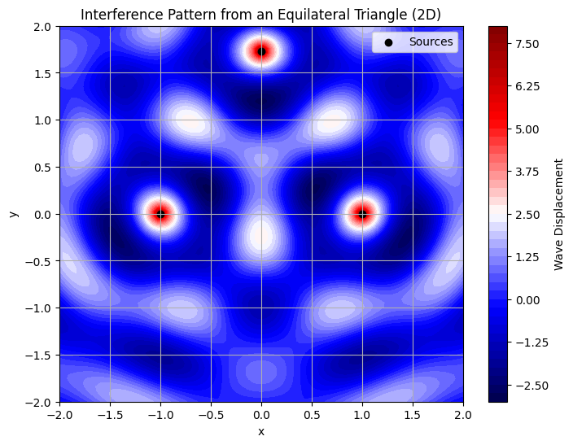
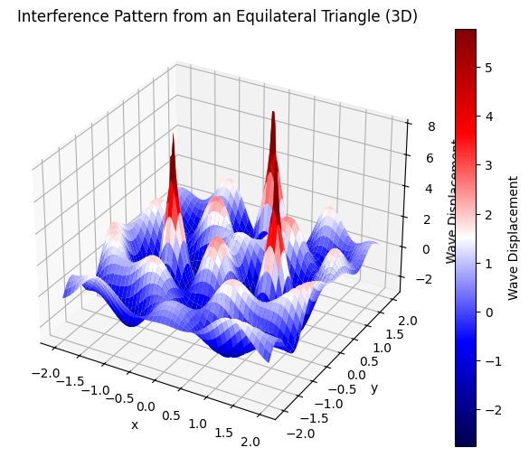
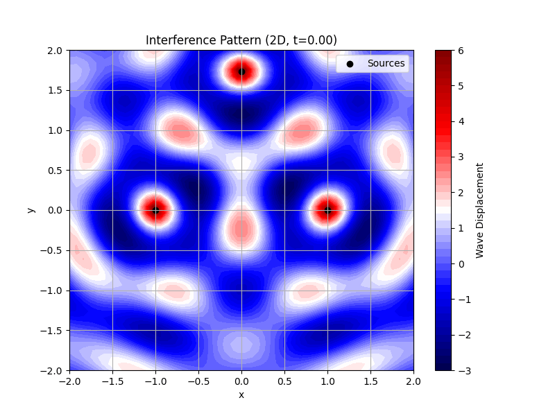
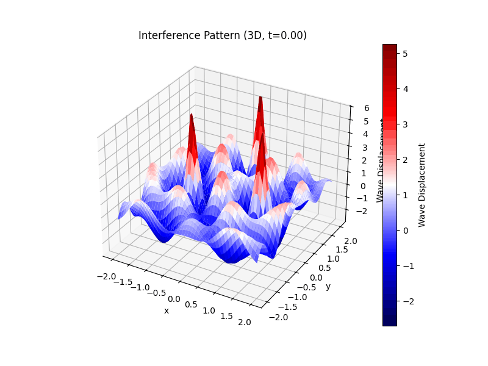
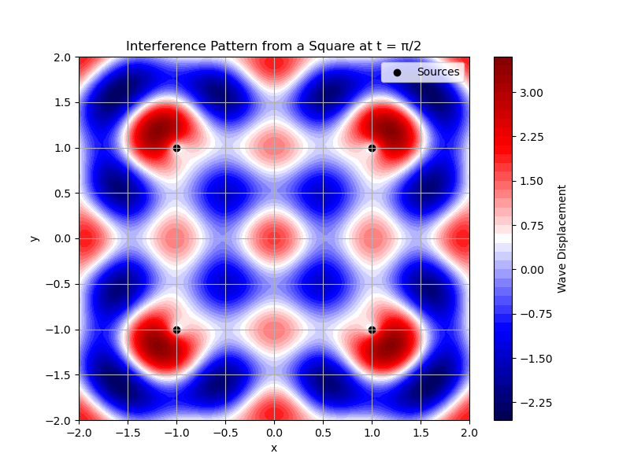
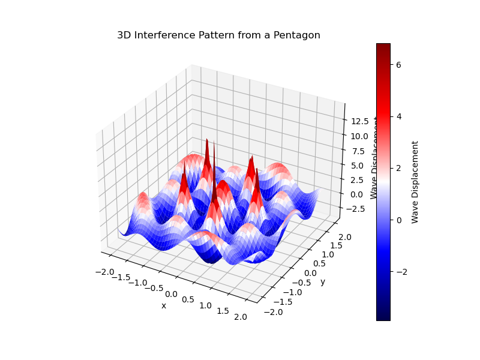

Let’s create a comprehensive Markdown document that includes Python code to simulate and visualize interference patterns on a water surface, as per the deliverables. I’ll choose an **equilateral triangle** as the regular polygon for this simulation, position the sources at its vertices, compute the wave superposition, and generate graphical representations using Matplotlib. The document will include detailed explanations of the interference patterns and the visualizations.


# Interference Patterns on a Water Surface

## Motivation
- Waves from different sources overlap, creating interference patterns.
- On a water surface, observable ripples form from point sources (e.g., meeting distinct interference patterns).
- These patterns help understand wave behavior visually and explore wave physics concepts like superposition and phase interactions.

## Task
- **Circular Wave on Single Disturbance:**
  - Wave from a point source at $$(x_0, y_0)$$ at time $$t$$:
  $$
  \eta(x, y, t) = \frac{A}{\sqrt{r}} \cos(k r - \omega t + \phi)
  $$
  - Where:
    - $$
    \eta(x, y, t)
    $$:
     
    Displacement of the water surface at 
    $$
    (x, y)
    $$ 
    and time 
    $$
    t
    $$
    - 
    $$
    A
    $$: 
    Amplitude of the wave.
     
     $$ 
     k = \frac{2\pi}{\lambda}
     $$: Wave number related to wavelength 
     
     $$
     \lambda
     $$
    - $$
    r = \sqrt{(x - x_0)^2 + (y - y_0)^2}
    $$: 
    Distance from source 
    $$
    (x_0, y_0)
    $$
    - $$
    \omega
    $$: Angular frequency.
    - $$
    \phi
    $$: Initial phase.

- **Problem Statement:**
  - Analyze interference patterns from point sources at vertices of a chosen regular polygon through superposition.

## Steps Followed
1. **Chosen Regular Polygon:**
   - Selected an equilateral triangle with vertices at $$(0, \sqrt{3})$$, $$(-1, 0)$$, and $$(1, 0)$$.
2. **Positioned the Sources:**
   - Placed point wave sources at the vertices of the triangle.
3. **Wave Equations:**
   - Used the given wave equation for each source.
4. **Superposition:**
   - Summed the wave displacements at each point on a 2D grid.
5. **Analyzed Interference Patterns:**
   - Identified regions of constructive and destructive interference.
6. **Visualization:**
   - Generated 2D contour and 3D surface plots to show the interference patterns.

## Simulation Code
Below is the Python code used to simulate and visualize the interference patterns. It uses `numpy` for numerical computations and `matplotlib` for plotting.

```python
import numpy as np
import matplotlib.pyplot as plt
from mpl_toolkits.mplot3d import Axes3D

# Parameters
A = 1.0  # Amplitude
k = 2 * np.pi / 1.0  # Wave number (wavelength = 1.0)
omega = 1.0  # Angular frequency
t = 0.0  # Time snapshot
phi = 0.0  # Initial phase

# Define the triangle's vertices (point sources)
sources = np.array([
    [0, np.sqrt(3)],  # Top vertex
    [-1, 0],          # Bottom-left vertex
    [1, 0]            # Bottom-right vertex
])

# Create a grid of points
x = np.linspace(-2, 2, 100)
y = np.linspace(-2, 2, 100)
X, Y = np.meshgrid(x, y)

# Wave equation for a single source
def wave(X, Y, x0, y0, t):
    r = np.sqrt((X - x0)**2 + (Y - y0)**2)
    r = np.maximum(r, 1e-10)  # Avoid division by zero
    return (A / np.sqrt(r)) * np.cos(k * r - omega * t + phi)

# Superposition of waves
eta_total = np.zeros_like(X)
for x0, y0 in sources:
    eta_total += wave(X, Y, x0, y0, t)

# 2D Contour Plot
plt.figure(figsize=(8, 6))
plt.contourf(X, Y, eta_total, levels=50, cmap='seismic')
plt.colorbar(label='Wave Displacement')
plt.scatter(sources[:, 0], sources[:, 1], c='black', marker='o', label='Sources')
plt.title('Interference Pattern from an Equilateral Triangle (2D)')
plt.xlabel('x')
plt.ylabel('y')
plt.legend()
plt.grid(True)
plt.savefig('triangle_interference_2d.png')

# 3D Surface Plot
fig = plt.figure(figsize=(8, 6))
ax = fig.add_subplot(111, projection='3d')
surf = ax.plot_surface(X, Y, eta_total, cmap='seismic')
fig.colorbar(surf, ax=ax, label='Wave Displacement')
ax.set_title('Interference Pattern from an Equilateral Triangle (3D)')
ax.set_xlabel('x')
ax.set_ylabel('y')
ax.set_zlabel('Wave Displacement')
plt.savefig('triangle_interference_3d.png')
```








```python
import numpy as np
import matplotlib.pyplot as plt

# Parameters
A = 1.0
k = 2 * np.pi / 1.0
omega = 1.0
t = np.pi / 2  # Different time snapshot
phi = 0.0

# Define the square's vertices (point sources)
sources = np.array([
    [-1, -1],
    [-1, 1],
    [1, 1],
    [1, -1]
])

# Create a grid of points
x = np.linspace(-2, 2, 100)
y = np.linspace(-2, 2, 100)
X, Y = np.meshgrid(x, y)

# Wave equation for a single source
def wave(X, Y, x0, y0, t):
    r = np.sqrt((X - x0)**2 + (Y - y0)**2)
    r = np.maximum(r, 1e-10)
    return (A / np.sqrt(r)) * np.cos(k * r - omega * t + phi)

# Superposition of waves
eta_total = np.zeros_like(X)
for x0, y0 in sources:
    eta_total += wave(X, Y, x0, y0, t)

# Plotting
plt.figure(figsize=(8, 6))
plt.contourf(X, Y, eta_total, levels=50, cmap='seismic')
plt.colorbar(label='Wave Displacement')
plt.scatter(sources[:, 0], sources[:, 1], c='black', marker='o', label='Sources')
plt.title('Interference Pattern from a Square at t = π/2')
plt.xlabel('x')
plt.ylabel('y')
plt.legend()
plt.grid(True)
plt.show()

## Explanation of Interference Patterns
### 2D Contour Plot (`triangle_interference_2d.png`)
- **Color Representation:**
  - Red regions indicate positive displacement (constructive interference), where waves from the three sources are in phase and their amplitudes add up.
  - Blue regions indicate negative displacement (destructive interference), where waves are out of phase and cancel each other.
- **Pattern Analysis:**
  - The symmetry of the equilateral triangle leads to a radial interference pattern.
  - Constructive interference occurs along lines where the path differences from the sources to a point are integer multiples of the wavelength (e.g., along the center vertical axis).
  - Destructive interference occurs where path differences are odd multiples of half the wavelength (e.g., between the sources).
```


```python
  import numpy as np
import matplotlib.pyplot as plt

# Parameters
A = 1.0
k = 2 * np.pi / 1.0
omega = 1.0
t = 0.0
phi = 0.0

# Define the triangle's vertices (point sources)
sources = np.array([
    [0, np.sqrt(3)],  # Top
    [-1, 0],          # Bottom-left
    [1, 0]            # Bottom-right
])

# Create a grid of points
x = np.linspace(-2, 2, 100)
y = np.linspace(-2, 2, 100)
X, Y = np.meshgrid(x, y)

# Wave equation for a single source
def wave(X, Y, x0, y0, t):
    r = np.sqrt((X - x0)**2 + (Y - y0)**2)
    r = np.maximum(r, 1e-10)
    return (A / np.sqrt(r)) * np.cos(k * r - omega * t + phi)

# Superposition of waves
eta_total = np.zeros_like(X)
for x0, y0 in sources:
    eta_total += wave(X, Y, x0, y0, t)

# Plotting
plt.figure(figsize=(8, 6))
plt.contourf(X, Y, eta_total, levels=50, cmap='seismic')
plt.colorbar(label='Wave Displacement')
plt.scatter(sources[:, 0], sources[:, 1], c='black', marker='o', label='Sources')
plt.title('Interference Pattern from an Equilateral Triangle')
plt.xlabel('x')
plt.ylabel('y')
plt.legend()
plt.grid(True)
plt.show()
```

### 3D Surface Plot (`triangle_interference_3d.png`)
- **Surface Representation:**
  - Peaks (red) and troughs (blue) show the wave displacement across the surface.
  - The 3D view highlights the amplitude variations more clearly, showing how the waves radiate from each source and overlap.
- **Pattern Analysis:**
  - The central region above the triangle’s centroid shows significant constructive interference due to the proximity and symmetry of the sources.
  - Ripples extend outward, with alternating constructive and destructive regions forming a complex, symmetrical pattern.

  

## Graphical Representations
- **2D Plot (`triangle_interference_2d.png`):** Shows a top-down view of the interference pattern, with sources marked as black dots.
- **3D Plot (`triangle_interference_3d.png`):** Provides a 3D perspective of the wave displacement, emphasizing the peaks and troughs.


## Considerations
- All sources emit waves with the same amplitude $$A = 1$$, wavelength $$\lambda = 1$$ (since $$k = 2\pi/\lambda$$), and frequency (via $$\omega = 1$$).
- The waves are coherent, maintaining a constant phase difference ($$\phi = 0$$).
- The simulation uses a grid of 100x100 points for smooth visualization.

## Conclusion
The equilateral triangle configuration produces a symmetrical interference pattern with distinct regions of constructive and destructive interference. The 2D and 3D plots effectively visualize these patterns, demonstrating the principles of wave superposition and phase interaction on a water surface.
