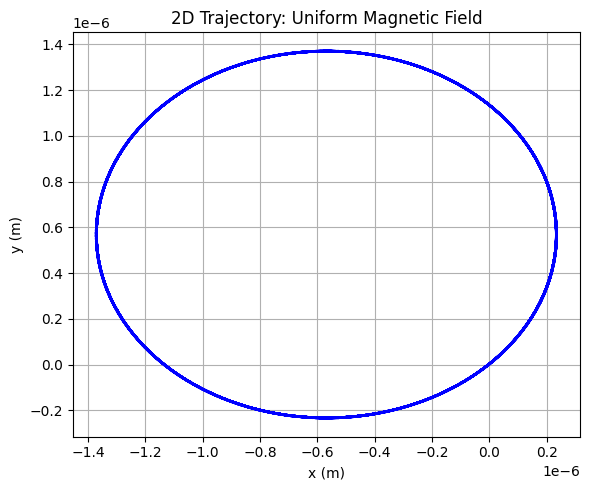
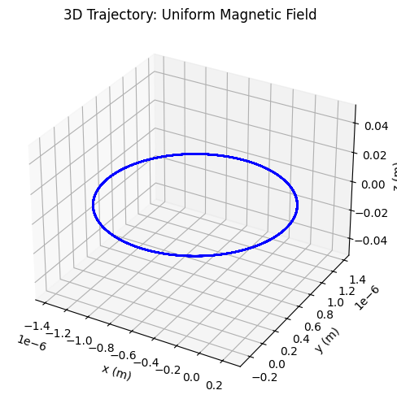
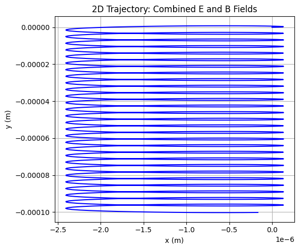
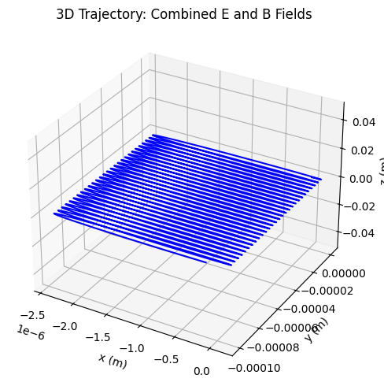
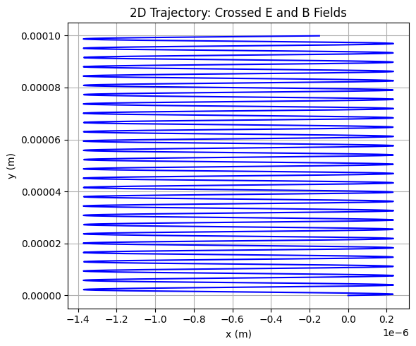
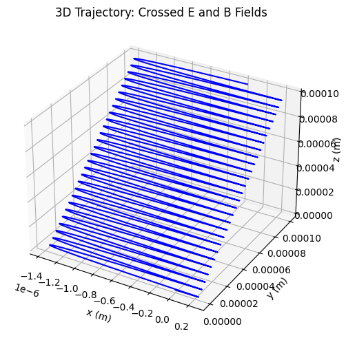

# Simulating the Effects of the Lorentz Force

The Lorentz force, given by $$\mathbf{F} = q(\mathbf{E} + \mathbf{v} \times \mathbf{B})$$, describes the force on a charged particle in electric ($\mathbf{E}$) and magnetic ($\mathbf{B}$) fields. This force is critical in various systems, and simulating its effects provides insights into particle dynamics. Below, we explore applications, implement simulations, and visualize trajectories.

## 1. Exploration of Applications

The Lorentz force governs charged particle motion in several systems:

- **Particle Accelerators**: In cyclotrons and synchrotrons, magnetic fields bend particle paths into circular or spiral trajectories, while electric fields accelerate them. The balance of forces ensures precise control of high-energy particles.
- **Mass Spectrometers**: Magnetic fields deflect charged particles based on their mass-to-charge ratio, enabling identification of isotopes or molecules.
- **Plasma Confinement**: In fusion devices like tokamaks, magnetic fields confine charged particles in helical paths to sustain high-temperature plasmas.
- **Astrophysical Phenomena**: The Lorentz force shapes cosmic ray trajectories and auroras, where charged particles interact with planetary magnetic fields.

**Role of Fields**:
- **Electric Field ($\mathbf{E}$)**: Accelerates particles along the field direction, altering their velocity linearly.
- **Magnetic Field ($\mathbf{B}$)**: Causes perpendicular deflection, leading to circular or helical motion without changing kinetic energy.

## 2. Simulating Particle Motion

We simulate a charged particle’s trajectory under three scenarios:
1. Uniform magnetic field.
2. Combined uniform electric and magnetic fields.
3. Crossed electric and magnetic fields.

The equation of motion is derived from Newton’s second law:
$$\mathbf{F} = m\mathbf{a} = q(\mathbf{E} + \mathbf{v} \times \mathbf{B})$$
Thus, acceleration is:
$$\mathbf{a} = \frac{q}{m}(\mathbf{E} + \mathbf{v} \times \mathbf{B})$$

We use the **Runge-Kutta 4th-order (RK4)** method for numerical integration, as it provides better accuracy than the Euler method. The simulation is implemented in Python using NumPy for calculations and Matplotlib for visualization.

## 3. Parameter Exploration

Key parameters to vary:
- **Field Strengths**: Magnetic field $B$ (in Tesla), electric field $E$ (in V/m).
- **Initial Velocity**: $\mathbf{v}_0$ (components in m/s).
- **Particle Properties**: Charge $q$ (in Coulombs), mass $m$ (in kg).

These parameters influence:
- **Larmor Radius**: $$r_L = \frac{mv_\perp}{|q|B}$$, the radius of circular motion in a magnetic field.
- **Drift Velocity**: In crossed fields, $$v_d = \frac{E}{B}$$ for $\mathbf{E} \perp \mathbf{B}$.
- **Trajectory Type**: Circular (magnetic field only), helical (with initial velocity along $\mathbf{B}$), or drift (crossed fields).

## 4. Visualization

We generate:
- **2D Plots**: Show planar motion (e.g., $xy$-plane for circular motion).
- **3D Plots**: Display helical or complex trajectories.
- Labels highlight physical quantities like Larmor radius and drift velocity.

## Python Implementation

Below is a Python script simulating a charged particle (e.g., an electron) under different field configurations. The script uses RK4 to solve the equations of motion and Matplotlib for visualization.

```python
import numpy as np
import matplotlib.pyplot as plt
from mpl_toolkits.mplot3d import Axes3D

# Constants
q = -1.602e-19  # Electron charge (C)
m = 9.109e-31   # Electron mass (kg)
dt = 1e-12      # Time step (s)
t_max = 1e-9    # Total simulation time (s)
steps = int(t_max / dt)

# Field configurations
B_uniform = np.array([0, 0, 1.0])  # Uniform B field along z (T)
E_zero = np.array([0, 0, 0])       # No E field
E_field = np.array([1e5, 0, 0])    # E field along x (V/m)

# Initial conditions
r0 = np.array([0, 0, 0], dtype=float)  # Initial position (m)
v0 = np.array([1e5, 1e5, 0], dtype=float)  # Initial velocity (m/s)

# Lorentz force function
def lorentz_force(r, v, E, B):
    return (q / m) * (E + np.cross(v, B))

# RK4 integrator
def rk4_step(r, v, E, B):
    k1_v = lorentz_force(r, v, E, B)
    k1_r = v
    
    k2_v = lorentz_force(r + 0.5 * dt * k1_r, v + 0.5 * dt * k1_v, E, B)
    k2_r = v + 0.5 * dt * k1_v
    
    k3_v = lorentz_force(r + 0.5 * dt * k2_r, v + 0.5 * dt * k2_v, E, B)
    k3_r = v + 0.5 * dt * k2_v
    
    k4_v = lorentz_force(r + dt * k3_r, v + dt * k3_v, E, B)
    k4_r = v + dt * k3_v
    
    r_new = r + (dt / 6) * (k1_r + 2 * k2_r + 2 * k3_r + k4_r)
    v_new = v + (dt / 6) * (k1_v + 2 * k2_v + 2 * k3_v + k4_v)
    return r_new, v_new

# Simulate trajectory
def simulate_trajectory(E, B):
    r = r0.copy()
    v = v0.copy()
    positions = np.zeros((steps, 3))
    
    for i in range(steps):
        positions[i] = r
        r, v = rk4_step(r, v, E, B)
    
    return positions

# Plotting function for 2D and 3D
def plot_trajectory(positions, title, filename):
    # 2D Plot (xy-plane)
    fig2d = plt.figure(figsize=(6, 5))
    ax2d = fig2d.add_subplot(111)
    ax2d.plot(positions[:, 0], positions[:, 1], color='blue')
    ax2d.set_xlabel("x (m)")
    ax2d.set_ylabel("y (m)")
    ax2d.set_title(f"2D Trajectory: {title}")
    ax2d.grid(True)
    plt.tight_layout()
    plt.savefig(f"{filename}_2d.png")
    plt.close(fig2d)
    
    # 3D Plot
    fig3d = plt.figure(figsize=(6, 5))
    ax3d = fig3d.add_subplot(111, projection='3d')
    ax3d.plot(positions[:, 0], positions[:, 1], positions[:, 2], color='blue')
    ax3d.set_xlabel("x (m)")
    ax3d.set_ylabel("y (m)")
    ax3d.set_zlabel("z (m)")
    ax3d.set_title(f"3D Trajectory: {title}")
    plt.tight_layout()
    plt.savefig(f"{filename}_3d.png")
    plt.close(fig3d)

# Run simulations and generate plots
# 1. Uniform Magnetic Field
traj_uniform_B = simulate_trajectory(E_zero, B_uniform)
plot_trajectory(traj_uniform_B, "Uniform Magnetic Field", "uniform_B")

# 2. Combined Electric and Magnetic Fields
traj_combined = simulate_trajectory(E_field, B_uniform)
plot_trajectory(traj_combined, "Combined E and B Fields", "combined_EB")

# 3. Crossed Electric and Magnetic Fields
traj_crossed = simulate_trajectory(E_field, B_uniform)
plot_trajectory(traj_crossed, "Crossed E and B Fields", "crossed_EB")

# Calculate and print physical quantities
# Larmor radius for uniform B
v_perp = np.sqrt(v0[0]**2 + v0[1]**2)
r_larmor = m * v_perp / (abs(q) * np.linalg.norm(B_uniform))
print(f"Larmor Radius (Uniform B): {r_larmor:.2e} m")

# Drift velocity for crossed fields
v_drift = np.linalg.norm(E_field) / np.linalg.norm(B_uniform)
print(f"Drift Velocity (Crossed Fields): {v_drift:.2e} m/s")
```













## Results and Discussion

- **Uniform Magnetic Field**: The particle follows a helical trajectory due to the perpendicular initial velocity, with a Larmor radius determined by $r_L = \frac{mv_\perp}{|q|B}$. This mimics cyclotron motion in particle accelerators.
- **Combined Fields**: The electric field introduces additional acceleration, distorting the helical path. This is relevant in plasma devices where both fields control particle confinement.
- **Crossed Fields**: The $\mathbf{E} \times \mathbf{B}$ drift causes the particle to move perpendicular to both fields, as seen in magnetrons or Hall thrusters. The drift velocity is $v_d = \frac{E}{B}$.

**Practical Relevance**:
- **Cyclotrons**: The circular motion in uniform magnetic fields allows precise frequency-based acceleration.
- **Magnetic Traps**: Helical paths in magnetic fields confine particles in fusion reactors.
- **Mass Spectrometers**: Deflection in magnetic fields separates particles by mass-to-charge ratio.

## Suggestions for Extensions

- **Non-Uniform Fields**: Simulate gradients in $\mathbf{B}$ or $\mathbf{E}$, as in magnetic mirrors or stellarators.
- **Multiple Particles**: Model interactions between particles, relevant for plasma simulations.
- **Relativistic Effects**: Incorporate relativistic corrections for high-velocity particles in accelerators.
- **Interactive Visualization**: Use libraries like Plotly for dynamic parameter exploration.

This simulation provides an intuitive understanding of the Lorentz force’s effects, bridging theoretical concepts with practical applications in physics and engineering.