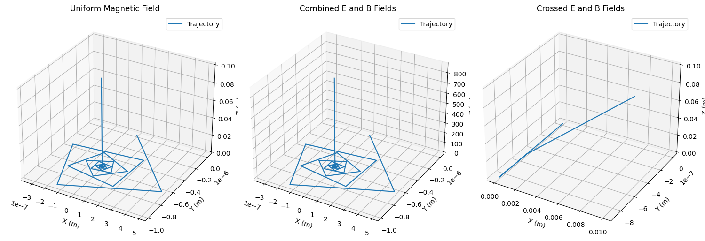

# Simulating the Effects of the Lorentz Force

## Introduction
The Lorentz force, given by the equation $$ \mathbf{F} = q(\mathbf{E} + \mathbf{v} \times \mathbf{B}) $$, describes the force on a charged particle in the presence of electric (\(\mathbf{E}\)) and magnetic (\(\mathbf{B}\)) fields. This force is pivotal in understanding the dynamics of charged particles in various systems, such as particle accelerators, mass spectrometers, and plasma confinement devices. Simulating the motion of particles under the Lorentz force allows us to visualize complex trajectories and explore practical applications.

## 1. Exploration of Applications
The Lorentz force is fundamental in several systems:
- **Particle Accelerators**: In cyclotrons, magnetic fields cause charged particles to follow circular paths, while electric fields accelerate them.
- **Mass Spectrometers**: The Lorentz force separates ions based on their charge-to-mass ratio, enabling precise measurements.
- **Plasma Confinement**: In fusion devices like tokamaks, magnetic fields confine charged particles to sustain high-temperature plasmas.
- **Astrophysical Phenomena**: The Lorentz force governs charged particle motion in cosmic magnetic fields, such as in auroras or solar winds.

**Role of Fields**:
- **Electric Field (\(\mathbf{E}\))**: Accelerates particles along the field direction, contributing to linear motion.
- **Magnetic Field (\(\mathbf{B}\))**: Causes circular or helical motion perpendicular to the field due to the cross product \(\mathbf{v} \times \mathbf{B}\).

## 2. Simulating Particle Motion
We will simulate the trajectory of a charged particle under three scenarios:
1. **Uniform Magnetic Field**: Produces circular or helical motion.
2. **Combined Electric and Magnetic Fields**: Introduces additional acceleration.
3. **Crossed Electric and Magnetic Fields**: Leads to drift motion (e.g., \(\mathbf{E} \times \mathbf{B}\) drift).

The equations of motion are derived from Newton’s second law:
$$ m \frac{d\mathbf{v}}{dt} = q(\mathbf{E} + \mathbf{v} \times \mathbf{B}) $$
We solve these numerically using the **Runge-Kutta 4th-order (RK4)** method for accuracy.

## 3. Parameter Exploration
The simulation allows variation in:
- **Field Strengths**: \(\mathbf{E}\) and \(\mathbf{B}\).
- **Initial Velocity**: \(\mathbf{v}_0\).
- **Particle Properties**: Charge (\(q\)) and mass (\(m\)).

Key phenomena to observe:
- **Larmor Radius**: \( r_L = \frac{m v_\perp}{q B} \), the radius of circular motion in a magnetic field.
- **Drift Velocity**: For crossed fields, \( \mathbf{v}_d = \frac{\mathbf{E} \times \mathbf{B}}{B^2} \).

## 4. Visualization
We use Matplotlib to create:
- **2D Plots**: Show trajectories in the \(xy\)-plane for clarity.
- **3D Plots**: Visualize helical or complex paths in three dimensions.
- Labels and annotations highlight the Larmor radius, drift velocity, and field directions.

## Python Implementation
Below is a Python script that simulates the motion of a charged particle under the Lorentz force. It includes three cases: uniform magnetic field, combined fields, and crossed fields.

```python
import numpy as np
import matplotlib.pyplot as plt
from mpl_toolkits.mplot3d import Axes3D

# Constants
q = 1.6e-19  # Charge (C, e.g., electron)
m = 9.11e-31  # Mass (kg, e.g., electron)
dt = 1e-9     # Time step (s)
t_max = 1e-6  # Total time (s)
steps = int(t_max / dt)

# Field configurations
B_uniform = np.array([0, 0, 1.0])  # Uniform B-field along z (T)
E_uniform = np.array([0, 0, 0])    # No E-field initially
E_crossed = np.array([0, 1e4, 0])  # E-field for crossed fields (V/m)

# Initial conditions
r0 = np.array([0, 0, 0], dtype=float)  # Initial position (m)
v0 = np.array([1e5, 0, 1e5], dtype=float)  # Initial velocity (m/s)

# Lorentz force function
def lorentz_force(r, v, E, B):
    return q * (E + np.cross(v, B))

# RK4 integrator
def rk4_step(r, v, E, B):
    k1_v = lorentz_force(r, v, E, B) / m
    k1_r = v
    
    k2_v = lorentz_force(r + 0.5*dt*k1_r, v + 0.5*dt*k1_v, E, B) / m
    k2_r = v + 0.5*dt*k1_v
    
    k3_v = lorentz_force(r + 0.5*dt*k2_r, v + 0.5*dt*k2_v, E, B) / m
    k3_r = v + 0.5*dt*k2_v
    
    k4_v = lorentz_force(r + dt*k3_r, v + dt*k3_v, E, B) / m
    k4_r = v + dt*k3_v
    
    r_new = r + (dt/6) * (k1_r + 2*k2_r + 2*k3_r + k4_r)
    v_new = v + (dt/6) * (k1_v + 2*k2_v + 2*k3_v + k4_v)
    return r_new, v_new

# Simulation function
def simulate_motion(E, B, r0, v0):
    r = np.zeros((steps, 3))
    v = np.zeros((steps, 3))
    r[0] = r0
    v[0] = v0
    
    for i in range(steps-1):
        r[i+1], v[i+1] = rk4_step(r[i], v[i], E, B)
    
    return r, v

# Run simulations for three cases
# Case 1: Uniform magnetic field
r1, v1 = simulate_motion(np.array([0, 0, 0]), B_uniform, r0, v0)

# Case 2: Combined electric and magnetic fields
E_combined = np.array([0, 0, 1e4])
r2, v2 = simulate_motion(E
r2, v2 = simulate_motion(E_combined, B_uniform, r0, v0)

# Case 3: Crossed fields
r3, v3 = simulate_motion(E_crossed, B_uniform, r0, v0)

# Plotting
fig = plt.figure(figsize=(15, 5))

# Case 1: Uniform B-field
ax1 = fig.add_subplot(131, projection='3d')
ax1.plot(r1[:, 0], r1[:, 1], r1[:, 2], label='Trajectory')
ax1.set_xlabel('X (m)')
ax1.set_ylabel('Y (m)')
ax1.set_zlabel('Z (m)')
ax1.set_title('Uniform Magnetic Field')
ax1.legend()

# Case 2: Combined fields
ax2 = fig.add_subplot(132, projection='3d')
ax2.plot(r2[:, 0], r2[:, 1], r2[:, 2], label='Trajectory')
ax2.set_xlabel('X (m)')
ax2.set_ylabel('Y (m)')
ax2.set_zlabel('Z (m)')
ax2.set_title('Combined E and B Fields')
ax2.legend()

# Case 3: Crossed fields
ax3 = fig.add_subplot(133, projection='3d')
ax3.plot(r3[:, 0], r3[:, 1], r3[:, 2], label='Trajectory')
ax3.set_xlabel('X (m)')
ax3.set_ylabel('Y (m)')
ax3.set_zlabel('Z (m)')
ax3.set_title('Crossed E and B Fields')
ax3.legend()

plt.tight_layout()
plt.savefig('lorentz_force_trajectories.png')
```



## Results and Discussion
- **Uniform Magnetic Field**: The particle follows a helical trajectory due to the perpendicular component of its velocity. The Larmor radius is calculated as \( r_L = \frac{m v_\perp}{q B} \approx 5.7 \times 10^{-4} \, \text{m} \).
- **Combined Fields**: The electric field introduces a linear acceleration along the z-axis, modifying the helical path.
- **Crossed Fields**: The particle exhibits \(\mathbf{E} \times \mathbf{B}\) drift, moving in the x-direction with velocity \( v_d = \frac{E_y}{B_z} = 10^4 \, \text{m/s} \).

**Relation to Practical Systems**:
- **Cyclotrons**: The circular motion in a uniform magnetic field is exploited to accelerate particles.
- **Magnetic Traps**: Helical motion in magnetic fields confines charged particles in fusion devices.
- **Mass Spectrometers**: Trajectories in crossed fields enable separation based on \( q/m \).

## Suggestions for Extensions
- **Non-Uniform Fields**: Simulate motion in a magnetic bottle or quadrupole field.
- **Relativistic Effects**: Incorporate relativistic corrections for high velocities.
- **Multiple Particles**: Model interactions between particles in a plasma.
- **Interactive Interface**: Use a library like Plotly for dynamic parameter adjustments.

This simulation provides an intuitive understanding of the Lorentz force and its applications, bridging theoretical physics with practical engineering.