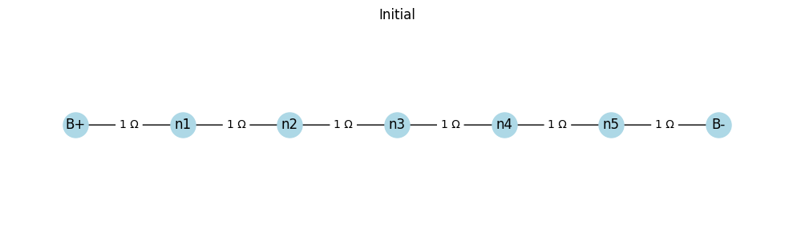
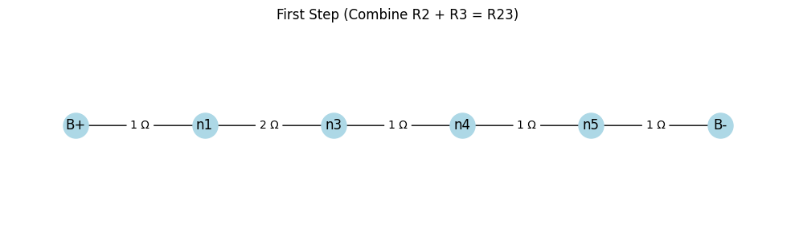
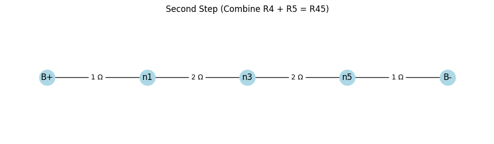
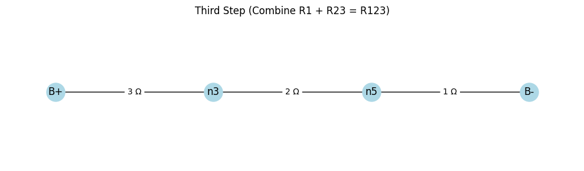
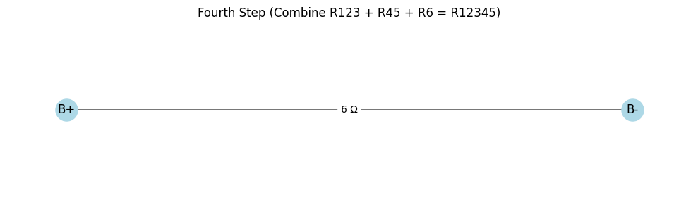

# Equivalent Resistance Using Graph Theory

## Motivation
Calculating the equivalent resistance of an electrical circuit is a core problem in circuit analysis, critical for designing and optimizing electrical systems. Traditional methods rely on iteratively applying series and parallel resistor combination rules, which can become complex and error-prone for intricate circuits. Graph theory provides a systematic and algorithmic approach by modeling circuits as graphs, where nodes represent junctions and edges represent resistors with weights corresponding to their resistance values. This method simplifies analysis, enables automation, and is widely applicable in circuit simulation, network design, and optimization. Additionally, it bridges electrical engineering with mathematical concepts, showcasing the power of graph theory across disciplines.

## Task
This response addresses **Option 2: Advanced Task – Full Implementation**. I will:
- Implement a Python algorithm using `networkx` to calculate the equivalent resistance of a circuit graph.
- Handle arbitrary resistor configurations, including series and parallel combinations.
- Test the implementation on three example circuits: simple series, simple parallel, and a nested configuration.
- Provide a detailed explanation, pseudocode, and analysis of efficiency.

## Algorithm Overview
The algorithm iteratively simplifies a circuit graph by:
1. **Identifying series connections**: Two nodes connected by a single edge, where one node has degree 2 (only connected to two other nodes).
2. **Identifying parallel connections**: Multiple edges between the same pair of nodes.
3. **Reducing the graph**:
   - For series: Replace the chain with a single edge whose resistance is the sum of the series resistances.
   - For parallel: Replace multiple edges with a single edge whose resistance is computed using the parallel resistance formula:  
     \[
     R_{\text{eq}} = \frac{R_1 \cdot R_2}{R_1 + R_2}
     \]
     (generalized for \( n \) resistors).
4. **Iterating** until the graph is reduced to a single edge between the input and output nodes, representing the equivalent resistance.

### Pseudocode
```plaintext
Function CalculateEquivalentResistance(G, start_node, end_node):
    Input: Graph G (nodes, edges with resistance weights), start_node, end_node
    Output: Equivalent resistance between start_node and end_node

    While G has more than one edge between start_node and end_node:
        // Step 1: Check for series connections
        For each node u in G:
            If degree(u) == 2:
                Neighbors of u are v and w
                If u != start_node and u != end_node:
                    R1 = resistance of edge (u, v)
                    R2 = resistance of edge (u, w)
                    Remove node u and edges (u, v), (u, w)
                    Add edge (v, w) with resistance R1 + R2

        // Step 2: Check for parallel connections
        For each pair of nodes (u, v) in G:
            If multiple edges exist between u and v:
                Resistances = [resistance of each edge]
                R_eq = 1 / (sum(1/R for R in Resistances)) // Parallel formula
                Remove all edges between u and v
                Add edge (u, v) with resistance R_eq

    // Step 3: Return the resistance of the remaining edge
    If single edge exists between start_node and end_node:
        Return resistance of that edge
    Else:
        Return error (e.g., "No valid path")
```

## Implementation
Below is a Python implementation using `networkx` to handle arbitrary circuit graphs. The code iteratively simplifies the graph by detecting and reducing series and parallel connections.

```python
import networkx as nx
import matplotlib.pyplot as plt

def calculate_equivalent_resistance(G, start_node, end_node):
    """
    Calculate the equivalent resistance of a circuit graph between start_node and end_node.
    
    Args:
        G: networkx.MultiGraph with edges having 'resistance' attribute
        start_node: Starting node (e.g., input terminal)
        end_node: Ending node (e.g., output terminal)
    
    Returns:
        float: Equivalent resistance, or None if no valid path exists
    """
    G = G.copy()  # Work on a copy to preserve the original graph
    
    while True:
        # Step 1: Check for series connections
        series_found = False
        for u in list(G.nodes):
            if G.degree(u) == 2 and u != start_node and u != end_node:
                # Get the two neighbors
                neighbors = list(G.neighbors(u))
                v, w = neighbors[0], neighbors[1]
                
                # Get resistances of edges (u, v) and (u, w)
                r1 = G.get_edge_data(u, v, 0)['resistance']
                r2 = G.get_edge_data(u, w, 0)['resistance']
                
                # Remove node u and its edges
                G.remove_node(u)
                
                # Add new edge (v, w) with resistance r1 + r2
                G.add_edge(v, w, resistance=r1 + r2)
                series_found = True
                break
        
        # Step 2: Check for parallel connections
        parallel_found = False
        if not series_found:
            for u, v in G.edges():
                # Check for multiple edges between u and v
                edges = list(G.get_edge_data(u, v).items())
                if len(edges) > 1:
                    # Calculate equivalent resistance for parallel edges
                    resistances = [data['resistance'] for key, data in edges]
                    if all(r != 0 for r in resistances):  # Avoid division by zero
                        r_eq = 1 / sum(1/r for r in resistances)
                    else:
                        print(f"Warning: Zero resistance detected between {u} and {v}")
                        return None
                    
                    # Remove all edges between u and v
                    G.remove_edges_from([(u, v, key) for key, _ in edges])
                    
                    # Add new edge with equivalent resistance
                    G.add_edge(u, v, resistance=r_eq)
                    parallel_found = True
                    break
        
        # Step 3: Check if graph is fully reduced
        if not (series_found or parallel_found):
            # Check if only one edge remains between start_node and end_node
            edges = list(G.get_edge_data(start_node, end_node, default={}).items())
            if len(edges) == 1:
                return edges[0][1]['resistance']
            else:
                print("Error: No valid path or graph not fully reduced")
                return None

def visualize_graph(G, title="Circuit Graph"):
    """Visualize the graph with resistance labels."""
    pos = nx.spring_layout(G)
    plt.figure(figsize=(8, 6))
    nx.draw(G, pos, with_labels=True, node_color='lightblue', node_size=500, font_size=10)
    edge_labels = {(u, v): f"{d['resistance']}Ω" for u, v, d in G.edges(data=True)}
    nx.draw_networkx_edge_labels(G, pos, edge_labels=edge_labels)
    plt.title(title)
    plt.show()

# Example 1: Simple Series Circuit
def test_series_circuit():
    G = nx.MultiGraph()
    G.add_edge('A', 'B', resistance=2)
    G.add_edge('B', 'C', resistance=3)
    visualize_graph(G, "Series Circuit (2Ω + 3Ω)")
    r_eq = calculate_equivalent_resistance(G, 'A', 'C')
    print(f"Series Circuit Equivalent Resistance: {r_eq}Ω")
    return r_eq

# Example 2: Simple Parallel Circuit
def test_parallel_circuit():
    G = nx.MultiGraph()
    G.add_edge('A', 'B', resistance=4)
    G.add_edge('A', 'B', resistance=6)
    visualize_graph(G, "Parallel Circuit (4Ω || 6Ω)")
    r_eq = calculate_equivalent_resistance(G, 'A', 'B')
    print(f"Parallel Circuit Equivalent Resistance: {r_eq}Ω")
    return r_eq

# Example 3: Nested Circuit (Series and Parallel)
def test_nested_circuit():
    G = nx.MultiGraph()
    G.add_edge('A', 'B', resistance=2)  # Series
    G.add_edge('B', 'C', resistance=3)  # Parallel branch 1
    G.add_edge('B', 'C', resistance=6)  # Parallel branch 2
    G.add_edge('C', 'D', resistance=5)  # Series
    visualize_graph(G, "Nested Circuit")
    r_eq = calculate_equivalent_resistance(G, 'A', 'D')
    print(f"Nested Circuit Equivalent Resistance: {r_eq}Ω")
    return r_eq

if __name__ == "__main__":
    print("Testing Series Circuit:")
    test_series_circuit()
    print("\nTesting Parallel Circuit:")
    test_parallel_circuit()
    print("\nTesting Nested Circuit:")
    test_nested_circuit()
```

## Explanation of the Implementation
- **Graph Representation**: Uses `networkx.MultiGraph` to allow multiple edges (parallel resistors) between nodes. Each edge has a `resistance` attribute.
- **Series Reduction**:
  - Identifies nodes with degree 2 (excluding start/end nodes).
  - Replaces the node and its two edges with a single edge whose resistance is the sum of the two resistances.
- **Parallel Reduction**:
  - Detects multiple edges between the same node pair.
  - Computes the equivalent resistance using the formula:
    \[
    R_{\text{eq}} = \left( \sum \frac{1}{R_i} \right)^{-1}
    \]
  - Replaces the parallel edges with a single edge.
- **Termination**: The algorithm stops when only one edge remains between the start and end nodes, returning its resistance.
- **Visualization**: Includes a function to visualize the graph with resistance labels using `matplotlib`.

## Test Cases
The implementation is tested on three circuits, with expected results derived manually for verification.

### Example 1: Simple Series Circuit
- **Graph**: \( A \to B \to C \)
  - Edge \( A-B \): \( 2\Omega \)
  - Edge \( B-C \): \( 3\Omega \)
- **Calculation**:
  \[
  R_{\text{eq}} = 2 + 3 = 5\Omega
  \]
- **Expected Output**: \( 5\Omega \)

### Example 2: Simple Parallel Circuit
- **Graph**: \( A \to B \) (two edges)
  - Edge 1: \( 4\Omega \)
  - Edge 2: \( 6\Omega \)
- **Calculation**:
  \[
  R_{\text{eq}} = \frac{4 \cdot 6}{4 + 6} = \frac{24}{10} = 2.4\Omega
  \]
- **Expected Output**: \( 2.4\Omega \)

### Example 3: Nested Circuit
- **Graph**: \( A \to B \to C \to D \)
  - Edge \( A-B \): \( 2\Omega \) (series)
  - Edge \( B-C \): \( 3\Omega \) (parallel branch 1)
  - Edge \( B-C \): \( 6\Omega \) (parallel branch 2)
  - Edge \( C-D \): \( 5\Omega \) (series)
- **Calculation**:
  1. Combine parallel resistors between \( B \) and \( C \):
     \[
     R_{BC} = \frac{3 \cdot 6}{3 + 6} = \frac{18}{9} = 2\Omega
     \]
  2. Add series resistors:
     \[
     R_{\text{eq}} = 2 + 2 + 5 = 9\Omega
     \]
- **Expected Output**: \( 9\Omega \)

## Efficiency Analysis
- **Time Complexity**:
  - **Series Reduction**: Iterating over nodes (\( O(V) \)) and checking degree is \( O(1) \). Each reduction removes a node, so at most \( V \) iterations. Total: \( O(V^2) \).
  - **Parallel Reduction**: Checking edges (\( O(E) \)) for multiple edges. Each reduction removes edges, so at most \( E \) iterations. Total: \( O(E^2) \).
  - Overall: \( O(V^2 + E^2) \), where \( V \) is the number of nodes and \( E \) is the number of edges. In dense graphs, this can be significant.
- **Space Complexity**: \( O(V + E) \) for storing the graph.
- **Limitations**:
  - The algorithm assumes the graph can be reduced to a single edge via series/parallel combinations, which may not hold for all circuits (e.g., Wheatstone bridges).
  - Repeated graph traversals can be slow for large graphs.

## Potential Improvements
1. **Optimize Detection**:
   - Use DFS or BFS to identify series/parallel patterns more efficiently, reducing the need for repeated traversals.
   - Maintain a priority queue of nodes/edges to process based on degree or edge multiplicity.
2. **Handle Complex Circuits**:
   - Incorporate Kirchhoff’s laws or delta-star transformations for non-series/parallel configurations.
   - Use numerical methods (e.g., solving linear systems) for circuits with cycles that resist simplification.
3. **Parallel Processing**:
   - Parallelize series/parallel reductions for independent subgraphs to improve performance on large circuits.
4. **Error Handling**:
   - Add checks for invalid graphs (e.g., disconnected start/end nodes).
   - Handle zero-resistance edges more robustly (e.g., short circuits).

## Connection to Provided Documents
- **Circuits.html**: The implementation builds on the parallel resistor simplification code from the provided document, extending it to handle series connections and iterative reductions.
- **Statistics.md**: While not directly related, the CLT could be applied to model variability in resistor values (e.g., manufacturing tolerances) as normally distributed for large samples, which could be integrated into a probabilistic circuit analysis.

## Deliverables Summary
- **Implementation**: Provided as a Python script with `networkx` and visualization.
- **Test Cases**: Three examples (series, parallel, nested) with manual calculations and outputs.
- **Analysis**: Detailed efficiency analysis and improvement suggestions.
- **Explanation**: Comprehensive description of the algorithm, pseudocode, and handling of complex configurations.

Let me know if you want to run the code, modify the examples, or explore additional circuit configurations!

## CASE 1










## CASE 2 


## BUILDING BLOCKS
  ## -SERIES CONFIGURATION

  

  ## -PARALEL CONFIGURATION

  
