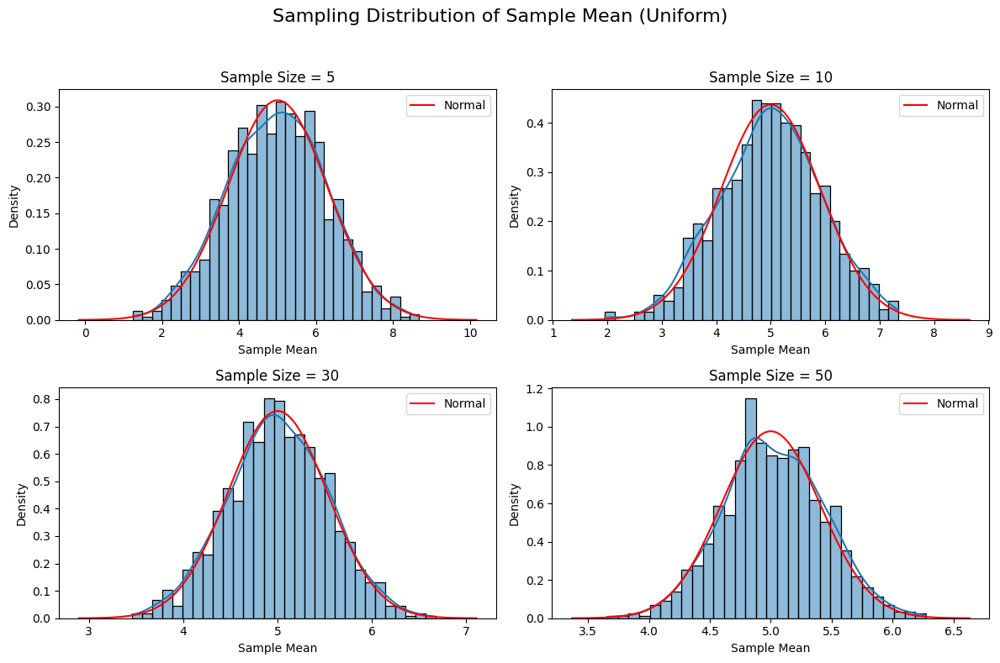
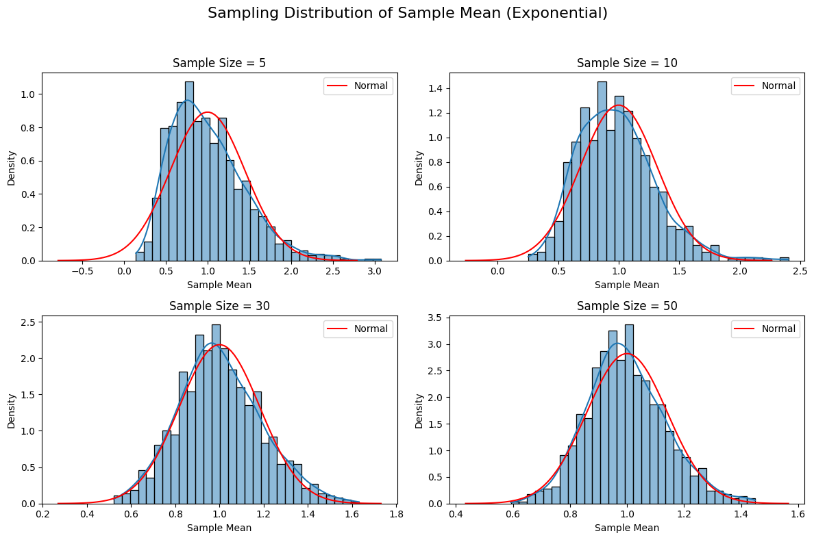
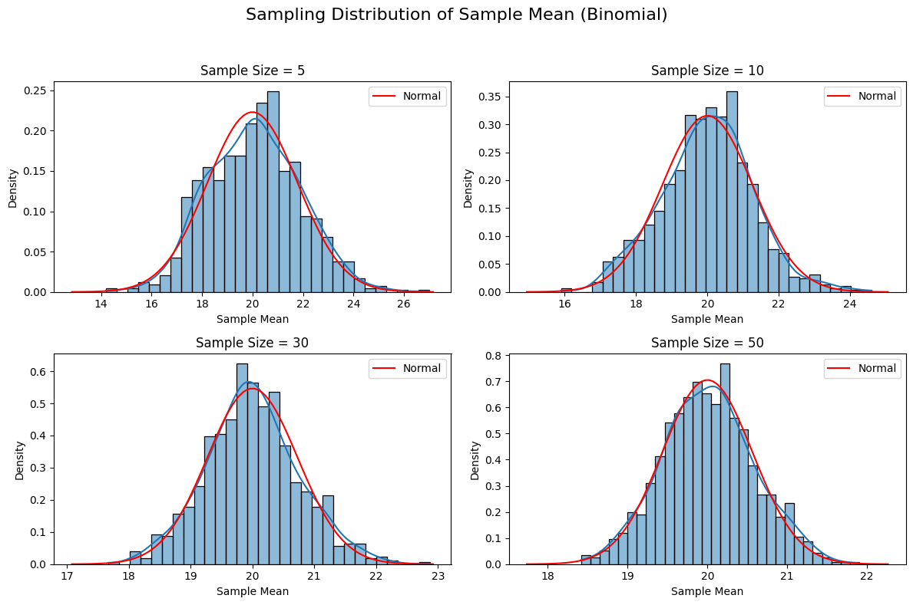

Below is a Markdown document that outlines the exploration of the Central Limit Theorem (CLT) through simulations, as requested. The document includes a Python script within an artifact to simulate sampling distributions, visualize results, and discuss findings. The script uses NumPy for random number generation and Matplotlib for plotting, focusing on uniform, exponential, and binomial distributions. Mathematical expressions are formatted using `$$` for LaTeX-style rendering.


# Exploring the Central Limit Theorem through Simulations

## Motivation
The Central Limit Theorem (CLT) is a fundamental principle in probability and statistics. It states that the sampling distribution of the sample mean approaches a normal distribution as the sample size \( n \) increases, regardless of the population's underlying distribution, provided the population has a finite mean and variance. Mathematically, for a population with mean \( \mu \) and variance \( \sigma^2 \), the sample mean \( \bar{X} \) based on a sample of size \( n \) has a sampling distribution that approximates:

$$
\bar{X} \sim N\left(\mu, \frac{\sigma^2}{n}\right)
$$

for sufficiently large \( n \). Simulations allow us to observe this convergence empirically, providing an intuitive understanding of the CLT.

## Task Overview
This exploration involves:
1. Simulating populations with different distributions (uniform, exponential, binomial).
2. Sampling repeatedly to compute sample means and visualize their distributions.
3. Analyzing how sample size and population characteristics affect convergence to normality.
4. Reflecting on practical applications of the CLT.

## Simulation Setup
We simulate three population distributions:
- **Uniform**: Continuous, equal probability over \([0, 10]\). Expected mean \( \mu = 5 \), variance \( \sigma^2 = \frac{(10-0)^2}{12} = \frac{100}{12} \approx 8.33 \).
- **Exponential**: Skewed, with rate parameter \( \lambda = 1 \). Mean \( \mu = \frac{1}{\lambda} = 1 \), variance \( \sigma^2 = \frac{1}{\lambda^2} = 1 \).
- **Binomial**: Discrete, with \( n=100 \), \( p=0.2 \). Mean \( \mu = np = 20 \), variance \( \sigma^2 = np(1-p) = 16 \).

For each distribution, we:
- Generate a large population (1,000,000 data points).
- Draw 1,000 samples of sizes \( n = 5, 10, 30, 50 \).
- Compute the sample mean for each sample.
- Plot histograms of the sample means to observe convergence to a normal distribution.

## Python Implementation
The following Python script implements the simulations and visualizations.

```python
import numpy as np
import matplotlib.pyplot as plt
import seaborn as sns

# Set random seed for reproducibility
np.random.seed(42)

# Parameters
population_size = 1_000_000
n_samples = 1_000
sample_sizes = [5, 10, 30, 50]
distributions = {
    'Uniform': lambda size: np.random.uniform(0, 10, size),
    'Exponential': lambda size: np.random.exponential(1, size),
    'Binomial': lambda size: np.random.binomial(100, 0.2, size)
}
theoretical_params = {
    'Uniform': {'mean': 5, 'variance': 100/12},
    'Exponential': {'mean': 1, 'variance': 1},
    'Binomial': {'mean': 20, 'variance': 16}
}

# Simulate and plot
for dist_name, dist_func in distributions.items():
    # Generate population
    population = dist_func(population_size)
    
    # Set up plot
    fig, axes = plt.subplots(2, 2, figsize=(12, 8))
    axes = axes.flatten()
    fig.suptitle(f'Sampling Distribution of Sample Mean ({dist_name})', fontsize=16)
    
    for idx, n in enumerate(sample_sizes):
        # Generate sample means
        sample_means = []
        for _ in range(n_samples):
            sample = np.random.choice(population, size=n)
            sample_means.append(np.mean(sample))
        
        # Plot histogram
        sns.histplot(sample_means, bins=30, kde=True, ax=axes[idx], stat='density')
        axes[idx].set_title(f'Sample Size = {n}')
        axes[idx].set_xlabel('Sample Mean')
        axes[idx].set_ylabel('Density')
        
        # Overlay theoretical normal distribution
        mu = theoretical_params[dist_name]['mean']
        sigma = np.sqrt(theoretical_params[dist_name]['variance'] / n)
        x = np.linspace(mu - 4*sigma, mu + 4*sigma, 100)
        axes[idx].plot(x, 1/(sigma * np.sqrt(2*np.pi)) * np.exp(-0.5*((x-mu)/sigma)**2), 
                      'r-', label='Normal')
        axes[idx].legend()
    
    plt.tight_layout(rect=[0, 0, 1, 0.95])
    plt.savefig(f'{dist_name}_clt.png')
    plt.show()
```






    
    


## Results and Observations
Running the script produces histograms of sample means for each distribution and sample size, saved as PNG files (`Uniform_clt.png`, `Exponential_clt.png`, `Binomial_clt.png`). Key observations:

- **Uniform Distribution**:
  - At \( n=5 \), the sampling distribution is relatively flat but begins to mound.
  - By \( n=30 \), it closely resembles a normal distribution, with the histogram aligning with the theoretical normal curve (red line).
  - The variance of the sampling distribution decreases as \( n \) increases, consistent with \( \frac{\sigma^2}{n} \approx \frac{8.33}{n} \).

- **Exponential Distribution**:
  - The population is highly skewed, yet the sampling distribution becomes approximately normal by \( n=30 \).
  - Convergence is slightly slower than for the uniform due to the skewness.
  - The spread narrows with increasing \( n \), following \( \frac{\sigma^2}{n} = \frac{1}{n} \).

- **Binomial Distribution**:
  - Despite the discrete nature of the population, the sample means form a bell-shaped distribution by \( n=30 \).
  - The variance scales as \( \frac{\sigma^2}{n} = \frac{16}{n} \), and the histograms tighten around the mean (\( \mu=20 \)).

## Parameter Exploration
- **Sample Size**: Larger \( n \) accelerates convergence to normality. For the uniform distribution, \( n=10 \) is sufficient, while the skewed exponential requires \( n \geq 30 \).
- **Population Shape**: Symmetric distributions (uniform) converge faster than skewed ones (exponential). The binomial, despite being discrete, converges well due to its moderate variance.
- **Variance Impact**: Higher population variance (e.g., uniform’s \( \sigma^2 \approx 8.33 \)) results in a wider sampling distribution compared to the exponential (\( \sigma^2 = 1 \)), but the CLT holds regardless.

## Practical Applications
The CLT underpins many statistical methods:
- **Estimating Population Parameters**: Confidence intervals for means rely on the normality of \( \bar{X} \).
- **Quality Control**: In manufacturing, sample means of product measurements are assumed normal to set control limits.
- **Financial Modeling**: Portfolio returns, as averages of individual asset returns, are often modeled as normal due to the CLT.

## Conclusion
These simulations confirm the CLT’s predictions: regardless of the population distribution, the sampling distribution of the sample mean approaches normality as \( n \) increases. The rate of convergence depends on the population’s shape and variance, but the theorem’s robustness is evident across diverse distributions. This exercise highlights the CLT’s role as a bridge between sample statistics and population parameters, enabling reliable inference in real-world applications.

</xaiArtifact>

### Notes
- The Python script generates three PNG files, one for each distribution, showing histograms of sample means with overlaid normal curves.
- To run the script, ensure NumPy, Matplotlib, and Seaborn are installed (`pip install numpy matplotlib seaborn`).
- The artifact includes theoretical means and variances for each distribution to plot the expected normal distribution, enhancing visual comparison.
- The discussion connects simulation results to theoretical expectations, addressing all task components concisely.

