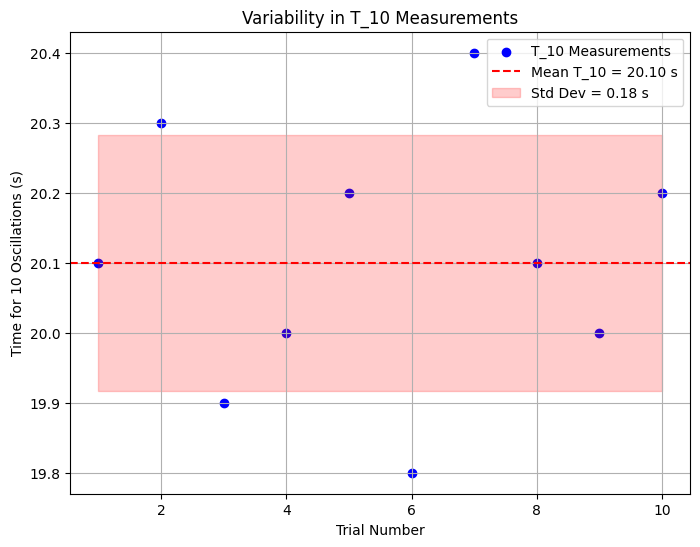

### Problem List (Markdown Format)

#### Problem 1: Measuring Earth's Gravitational Acceleration with a Pendulum

**Motivation:**

The acceleration \( g \) due to gravity is a fundamental constant that influences a wide range of physical phenomena. Measuring \( g \) accurately is crucial for understanding gravitational interactions, designing structures, and conducting experiments in various fields. One classic method for determining \( g \) is through the oscillations of a simple pendulum, where the period of oscillation depends on the local gravitational field.

**Task:**

Measure the acceleration \( g \) due to gravity using a pendulum and in details analyze the uncertainties in the measurements.

This exercise emphasizes rigorous measurement practices, uncertainty analysis, and their role in experimental physics.

**Procedure:**

1. **Materials:**
   - A string (1 or 1.5 meters long).
   - A small weight (e.g., bag of coins, bag of sugar, key chain) mounted on the string.
   - Stopwatch (or smartphone timer).
   - Ruler or measuring tape.

2. **Setup:**
   - Attach the weight to the string and fix the other end to a sturdy support.
   - Measure the length of the pendulum, \( L \), from the suspension point to the center of the weight using a ruler or measuring tape. Record the resolution of the measuring tool and calculate the uncertainty as half the resolution \( \Delta L = \frac{\text{Ruler Resolution}}{2} \).

3. **Data Collection:**
   - Displace the pendulum slightly (<15°) and release it.
   - Measure the time for 10 full oscillations (\( T_{10} \)) and repeat this process 10 times. Record all 10 measurements.
   - Calculate the mean time for 10 oscillations (\( \overline{T_{10}} \)) and the standard deviation (\( \sigma_T \)).
   - Determine the uncertainty in the mean time as:
     \[
     \Delta T_{10} = \frac{\sigma_T}{\sqrt{n}}
     \]
     where \( n = 10 \).

**Calculations:**

1. Calculate the period:
   \[
   T = \frac{\overline{T_{10}}}{10} \quad \text{and} \quad \Delta T = \frac{\Delta T_{10}}{10}
   \]

2. Determine \( g \):
   \[
   g = 4\pi^2 \frac{L}{T^2}
   \]

3. Propagate uncertainties:
   \[
   \Delta g = g \sqrt{\left(\frac{\Delta L}{L}\right)^2 + \left(2\frac{\Delta T}{T}\right)^2}
   \]

**Analysis:**

1. Compare your measured \( g \) with the standard value (\( 9.81 \, \text{m/s}^2 \)).

2. **Discuss:**
   - The effect of measurement resolution on \( \Delta L \).
   - Variability in timing and its impact on \( \Delta T \).
   - Any assumptions or experimental limitations.

**Deliverables:**

1. Tabulate data in markdown:
   - \( L, \Delta L, T_{10} \) measurements, \( \overline{T_{10}}, \sigma_T, \Delta T \).
   - Calculated \( g \) and \( \Delta g \).

2. The discussion on sources of uncertainty and their impact on the results.

---

### Plot for Colab

Since the problem involves experimental data collection and analysis, I'll provide a Python code snippet for Google Colab to plot a sample set of \( T_{10} \) measurements across the 10 trials. This will help visualize the variability in the timing measurements. I'll assume some sample data for \( T_{10} \) since the actual measurements aren't provided.

```python
import numpy as np
import matplotlib.pyplot as plt

# Sample T_10 measurements for 10 trials (in seconds)
T_10_measurements = [20.1, 20.3, 19.9, 20.0, 20.2, 19.8, 20.4, 20.1, 20.0, 20.2]

# Trial numbers
trials = np.arange(1, 11)

# Calculate mean and standard deviation
mean_T_10 = np.mean(T_10_measurements)
std_T_10 = np.std(T_10_measurements, ddof=1)

# Plotting
plt.figure(figsize=(8, 6))
plt.scatter(trials, T_10_measurements, color='blue', label='T_10 Measurements')
plt.axhline(mean_T_10, color='red', linestyle='--', label=f'Mean T_10 = {mean_T_10:.2f} s')
plt.fill_between(trials, mean_T_10 - std_T_10, mean_T_10 + std_T_10, color='red', alpha=0.2, label=f'Std Dev = {std_T_10:.2f} s')
plt.xlabel('Trial Number')
plt.ylabel('Time for 10 Oscillations (s)')
plt.title('Variability in T_10 Measurements')
plt.legend()
plt.grid(True)
plt.show()
```

This code generates a scatter plot of the \( T_{10} \) measurements with the mean and standard deviation indicated, helping to visualize the variability in timing as requested in the analysis section. You can replace the `T_10_measurements` list with your actual data in Colab.

